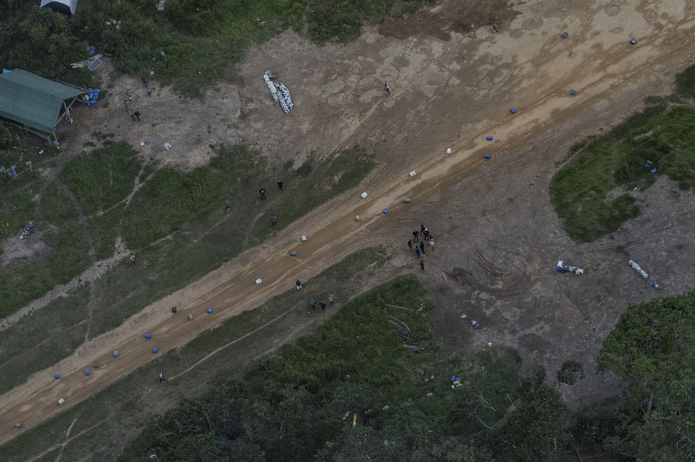

## Lula da Silva

[During Lula's presidency in Brazil (2003–2011), the country officially left the UN "Hunger Map" after reaching total food sovereignty for the first time.](https://v.redd.it/0kezfxhjk7z91)

Number-crunchers say rising incomes catapulted more than 29 million Brazilians into the middle class during the eight-year presidency of Luiz Inácio Lula da Silva, a former trade unionist elected in 2002. ([AP News](https://apnews.com/article/5c74f94eadaf47c28995416d5e9fae85))

Brazilians stayed in school longer, which secured higher wages, which drove consumption, which in turn fuelled a booming domestic economy. He left office in 2010, having presided over average annual growth of 4.5%, a 50% increase in average Brazilian incomes, and a hefty drop in unemployment, poverty and government debt. ([The Economist](https://www.economist.com/the-americas/2023/01/26/as-lula-takes-over-brazils-economic-prospects-are-looking-up))

**Bolsa Família** → Direct cash payments to poor families. Bolsa Família has been mentioned as one factor contributing to the reduction of poverty in Brazil, which fell 27.7% during the first term. In 2006, the Center for Political Studies of the [Getulio Vargas Foundation](https://en.wikipedia.org/wiki/Funda%C3%A7%C3%A3o_Get%C3%BAlio_Vargas) published a study showing a sharp reduction in the number of people in poverty in Brazil between 2003 and 2005.

**Luz Para Todos** → Electricity for remote and rural areas.

Lula was twice elected by large margins, in 2002 and then again in 2006, and left office with an 87 percent approval rate.

### Unpopular with the Wealthy and Elites

...among wealthier Brazilians and some politically influential actors such as businesspeople, the mainstream media and evangelical churches (Almeida, 2019; Pereira and Viola, 2019; see also Van Dijk, 2017).

*Almeida, R. (2019) 'Bolsonaro presidente: conservadorismo, evangelismo e a crise brasileira'. Novos Estudos CEBRAP 38(1): 185–213.*

*Pereira, J. C. and Viola, E. (2019) 'Catastrophic Climate Risk and Brazilian Amazonian Politics and Policies: A New Research Agenda'. Global Environmental Politics 19(2): 93–103.*

*Van Dijk, T. A. (2017) 'How Globo Media Manipulated the Impeachment of Brazilian President Dilma Rousseff'. Discourse & Communication 11(2): 199–229.*

### Prelude to the Bolsonaro Regime

Once Michel Temer became president through Rousseff's controversial impeachment in 2016, several authoritarian and neoliberal reforms were then advanced, reducing labour rights, public spending, and governmental programmes aimed at social inclusion (Søndergaard, 2020).

*Søndergaard, N. (2020) 'Reforming in a Democratic Vacuum: The Authoritarian Neoliberalism of the Temer Administration from 2016 to 2018'. Globalizations 18(4): 568–583.*

Work on sustainable development in Brazil had, therefore, already been watered down when Bolsonaro's ascension galvanised the reversal of social and environmental protections (Siegel and Bastos Lima, 2020).

*Siegel, K. and Bastos Lima, M. G. (2020) 'When International Sustainability Frameworks Encounter Domestic Politics: The Sustainable Development Goals and Agri-Food Governance in South America'. World Development 135: 1–13.*

## Bolsonaro

Bolsonaro sowed doubt about the reliability of the nation's electronic voting system — without any evidence:

- [Bolsonaro is sowing doubt in Brazil's electoral system (CNN)](https://edition.cnn.com/2021/08/06/americas/bolsonaro-brazil-elections-intl-latam/index.html)
- [Bolsonaro vs. Lula: All you need to know (CNBC)](https://www.cnbc.com/2022/09/14/bolsonaro-vs-lula-all-you-need-to-know-ahead-of-brazils-election.html)
- [Bolsonaro's attack on Brazil's electoral system sparks outrage (The Guardian)](https://www.theguardian.com/world/2022/jul/19/bolsonaro-attack-on-brazil-electoral-system-sparks-outrage)

He also sought to dismiss the severity of torture and human rights abuses committed during Brazil's military dictatorship (1964–1985):

- [Brazil: Bolsonaro Celebrates Brutal Dictatorship (HRW)](https://www.hrw.org/news/2019/03/27/brazil-bolsonaro-celebrates-brutal-dictatorship)
- [First Conviction for Dictatorship Crimes in Brazil (HRW)](https://www.hrw.org/news/2021/06/22/first-conviction-dictatorship-crimes-brazil)

> "I am in favour of torture, you know that. And the people are in favour as well." — Jair Bolsonaro ([1999](https://www.nytimes.com/2018/10/28/world/americas/brazil-president-jair-bolsonaro-quotes.html))

Once, following a visit to a settlement of African slave descendants called a quilombo, Bolsonaro suggested they were all overweight:

> "I visited a quilombo and the least heavy afro-descendant weighed seven arrobas (approximately 230 pounds). They do nothing! They are not even good for procreation."

From a [1999 interview on Brazilian television](https://eu.usatoday.com/story/news/world/2018/10/29/jair-bolsonaro-brazils-new-president-has-said-many-offensive-things/1804519002/):

> "Elections won't change anything in this country. It will only change on the day that we break out in civil war here and do the job that the military regime didn't do: killing 30,000. If some innocent people die, that's fine. In every war, innocent people die."

[In 2015, Bolsonaro referred to immigrants from Haiti, Senegal, Bolivia and Syria as the](https://www.tandfonline.com/doi/full/10.1080/01436597.2022.2153664)

> 'scum of the world'

[When expressing his opposition to the 2017 Migration Law, Bolsonaro stated that](https://onlinelibrary.wiley.com/doi/abs/10.1111/blar.13166):

> '[immigrants'] behaviour, their culture, is completely different from ours' and that the law would 'open wide' the country 'to all sorts of people'

[In 2017, he controversially said that](https://www.bbc.com/news/world-latin-america-45746013):

> "a policeman who doesn't kill isn't a policeman"

He once said to Congress ([The Guardian](https://www.theguardian.com/world/2019/sep/11/carlos-bolsonaro-brazil-democracy-dictatorship-jair), [Folha de S.Paulo](https://www1.folha.uol.com.br/poder/2018/06/nos-anos-90-bolsonaro-defendeu-novo-golpe-militar-e-guerra.shtml)):

> "Yes, I'm in favor of a dictatorship."

[Câmara Aberta TV program](https://youtu.be/qIDyw9QKIvw?t=890), May 23, 1999:

> "The pau-de-arara [a torture technique] works. I'm in favor of torture, you know that. And the people are in favor as well."

[Câmara Aberta TV program](https://www.youtube.com/watch?v=KTPT_oCtbDU), May 23, 1999:

> "Through the vote, you will not change anything in this country, nothing, absolutely nothing! It will only change, unfortunately, when, one day, we start a civil war here and do the work that the military regime did not do. Killing some 30,000, starting with FHC [then-President Fernando Henrique Cardoso], not kicking them out, killing! If some innocent people are going to die, fine, in any war, innocents die."

### Against Indigenous Populations

He weakened the Brazilian Institute of the Environment and Renewable Natural Resources (IBAMA), the Institute for the Conservation of Biodiversity (ICMBio) and the government agency tasked with protecting Indigenous rights (FUNAI). The Brazilian government also halted the recognition of traditional Indigenous lands and issued regulations harmful to Indigenous people. Bolsonaro's policies emboldened miners, loggers, land-grabbers and poachers, leading to devastating consequences for Indigenous people and the environment. Marcelo Xavier, appointed by Bolsonaro to preside over FUNAI, is accused of creating a climate of fear and intimidation within the agency.

[Brazil: Indigenous Rights Under Serious Threat (HRW)](https://www.hrw.org/news/2022/08/09/brazil-indigenous-rights-under-serious-threat)

[Summary of racist remarks against indigenous people (Survival International)](https://www.survivalinternational.org/articles/3540-Bolsonaro)

> "If I become President there will not be a centimeter more of Indigenous land." — Jair Bolsonaro

> ["Indians are undoubtedly changing … They are increasingly becoming human beings just like us."](https://www.theguardian.com/world/2020/jan/24/jair-bolsonaro-racist-comment-sparks-outrage-indigenous-groups) — Jair Bolsonaro

> "The Indians do not speak our language, they do not have money, they do not have culture. They are native peoples. How did they manage to get 13% of the national territory?" — Jair Bolsonaro

> "[Indigenous reserves] are an obstacle to agri-business. You can't reduce Indigenous land by even a square meter in Brazil." — Jair Bolsonaro

> "In 2019 we're going to rip up Raposa Serra do Sol [Indigenous Territory in Roraima, northern Brazil]. We're going to give all the ranchers guns." — Jair Bolsonaro

> "If I'm elected, I'll serve a blow to FUNAI (Brazil's department for Indigenous affairs); a blow to the neck. There's no other way. It's not useful anymore." — Jair Bolsonaro

### Sexist and Homophobic Remarks

[Folha de São Paulo](https://www1.folha.uol.com.br/fsp/cotidian/ff1905200210.htm), May 19, 2002:

> "I will not fight nor discriminate, but if I see two men kissing in the street, I'll hit them."

He publicly claimed that Patricia Campos Mello, a reporter for Folha de Sao Paulo, offered sex in exchange for information regarding an investigative piece on the 2018 Brazilian presidential election. In response, Campos Mello sued Bolsonaro. [A court ruled that Bolsonaro must pay "moral damages" of 35,000 reais to the journalist.](https://edition.cnn.com/2022/06/29/americas/bolsonaro-court-order-compensation-sexist-remarks-intl-latam/index.html)

He stated [he wouldn't pay women the same salary as men](https://www.redetv.uol.com.br/superpop/videos/ultimos-programas/bolsonaro-diz-que-nao-pagaria-a-mulheres-o-mesmo-salario-dos-homens).

[Bolsonaro said before Congress in 2011](http://noticias.terra.com.br/brasil/polemicas-de-bolsonaro/):

> "If you like homosexuals, admit it. If your thing is homosexual love, admit it. But don't let that cowardliness get into first grade."

[Bolsonaro told Playboy magazine in 2011 that he'd rather his child die than be gay](http://noticias.terra.com.br/brasil/polemicas-de-bolsonaro/):

> "I would be incapable of loving a gay son."

### The Policies of Bolsonaro

Bolsonaro increasingly disengaged Brazil from the international sustainability agenda. He cancelled the country's scheduled hosting of COP 25 in 2019, suspended the submission of further voluntary national reviews on the SDGs, and ditched most international collaboration on environmental conservation. Domestically, he abolished the Comissão Nacional para os Objetivos do Desenvolvimento Sustentável (CNODS, National Commission for the Sustainable Development Goals), created in October 2016 to coordinate SDG implementation between federal government agencies and civil society organisations. In April 2019 the Bolsonaro administration dissolved most public bodies that were not established by law but by decrees or ministerial orders — CNODS was terminated alongside about 500 other multi-stakeholder commissions and councils.

*Russo Lopes, G. and Bastos Lima, M. G. (2020) 'Necropolitics in the Jungle: COVID-19 and the Marginalisation of Brazil's Forest Peoples'. Bulletin of Latin American Research 39(S1): 92–97.*



Instead of bolstering the institutions of law and order so that they can restore calm and prosecute gang bosses, Bolsonaro argued the way to tackle violence was with more violence. He allowed more Brazilians to own and carry guns, encouraging them to confront criminals themselves, and sought to make it harder to punish police officers who kill suspects. ([The Economist](https://www.economist.com/leaders/2019/05/30/jair-bolsonaro-will-not-defeat-crime-in-brazil-by-tolerating-militias))

#### Disastrous Response to the 2019 Oil Spill

Through its measures to reduce public spending in April 2019, the federal government had shut down the executive and support committees created in 2013 as part of the Contingency Plan for Oil Pollution Incidents. Both the delay in enforcing the contingency plan and the closure of its main bodies seriously affected federal authorities' response, described by some as 'government malfeasance' (Brum, Campos-Silva and Oliveira, 2020). Mismanagement is clear, though perverse intentionality has never been evidenced.

*Soares, M. O. et al. (2020) 'Oil Spill in South Atlantic (Brazil): Environmental and Governmental Disaster'. Marine Policy 115: 103879.*

#### Brazil Returns to the UN Hunger Map

- [WFP documentation](https://documents.wfp.org/stellent/groups/public/documents/communications/wfp229328.pdf)
- [Why the UN added Brazil to the hunger map (Global Voices)](https://globalvoices.org/2022/08/30/why-the-un-added-brazil-to-the-hunger-map-once-again/)
- [Brazil faces the return of hunger (Le Monde)](https://www.lemonde.fr/en/economy/article/2022/06/09/brazil-is-facing-the-return-of-hunger_5986229_19.html)

Agribusiness agents assassinated 430 indigenous people during 2021 according to CIMI ([The Missionary Council for Indigenous Peoples](https://revistaperiferias.org/en/materia/cimi-the-missionary-council-for-indigenous-peoples/)). 345 territories burned in 2019, an 87% increase since 2018. 1,530 new pesticides were authorised by his government during 2019–2021.

According to [Instituto Nacional de Pesquisas Espaciais (INPE)](https://www.gov.br/inpe/pt-br), land expropriation significantly increased, with fires almost doubling between 2018 and 2019.

**Deforestation**: Between 2019 and 2021, the surface equivalent of Belgium was razed in the Amazon forest according to satellite imagery. 20 environmentalists were assassinated in 2020 according to *Global Witness*.

For the problem of Amazon destruction, Bolsonaro responded by [firing the head of the scientific body](https://www.theguardian.com/world/2019/aug/02/brazil-space-institute-director-sacked-in-amazon-deforestation-row) that reports the data, which the president called "lies." His appointed environment minister, Ricardo Salles, was known to relax environmental and logging restrictions so much he earned the nickname "Mr. Chainsaw" from some US authorities.

Brazil's position as one of the world's largest economies fell from 7th place (2010–2014) to 13th. The minimum wage was adjusted below inflation levels.

### On the Amazon

Amazon deforestation is once again on the rise after Brazil successfully reduced its annual rate by 70 percent between 2005 and 2014 (Moutinho, Guerra and Azevedo-Ramos, 2016).

*Moutinho, P., Guerra, R. and Azevedo-Ramos, C. (2016) 'Achieving Zero Deforestation in the Brazilian Amazon: What is Missing?'. Elementa: Science of the Anthropocene 4: 1–11.*

[Bolsonaro's neoliberal program (Capital & Class)](https://journals.sagepub.com/doi/pdf/10.1177/0309816820971131)

[The Illegal Airstrips Bringing Toxic Mining to Brazil's Indigenous Land (NYT)](https://www.nytimes.com/interactive/2022/08/02/world/americas/brazil-airstrips-illegal-mining.html)





### Firing the Head of INPE Over Deforestation Data

- [Brazilian institute head fired after clashing with president over deforestation data (Science)](https://www.science.org/content/article/brazilian-institute-head-fired-after-clashing-nation-s-president-over-deforestation)
- [Deforestation in the Amazon is shooting up, but Brazil's president calls the data 'a lie' (Science)](https://www.science.org/content/article/deforestation-amazon-shooting-brazil-s-president-calls-data-lie)

INPE released a statement to "reaffirm its confidence in the quality of the data produced by DETER," noting that it has consistently used a well-known method for 15 years. Official deforestation rates fell by 80% between 2004, when DETER became operational, and 2014. Since then, they have been trending up slightly.

### Undermining IBAMA and Its Funding

[IBAMA funding cuts (Reuters)](https://www.reuters.com/article/us-brazil-environment-ibama-exclusive-idUSKCN1VI14I)

### Corruption

Bolsonaro acquired around 50 properties in cash: [The Guardian](https://amp.theguardian.com/world/2022/aug/30/jair-bolsonaro-brazil-property-payments-cash-allegations)

Leonardo Sakamoto, a UOL columnist, [wrote](https://noticias.uol.com.br/colunas/leonardo-sakamoto/2022/08/30/investigacao-aponta-que-familia-bolsonaro-e-grande-lavanderia-de-dinheiro.htm): "You don't need to be a financial genius to understand that the use of large sums of cash to buy property is a means of laundering resources of illegal origin."

His senator son, Flávio Bolsonaro, [paid 638,000 reais in cash](https://g1.globo.com/rj/rio-de-janeiro/noticia/2019/12/19/flavio-bolsonaro-pagou-r-638-mil-em-dinheiro-para-lavar-compra-de-imoveis-diz-mp.ghtml) for two flats in Rio's Copacabana neighbourhood. They never explained the origin of this money or why they decided to use cash instead of making an electronic transfer.

### COVID-19

> "because of my background as an athlete, I wouldn't need to worry if I was infected by the virus. I wouldn't feel anything or at the very worst it would be like a little flu or a bit of a cold." — Jair Bolsonaro

> "the people will soon see that they were tricked by these governors and by the large part of the media when it comes to coronavirus."

On 28 April 2020, when a reporter pointed out that Brazil's death toll had surpassed China's, he replied:

> "So what? I'm sorry, but what do you want me to do?"

> "the majority of Brazilians contract this virus and don't notice a thing. Life goes on. Brazil needs to produce. You need to get the economy in gear."

[Governing COVID-19 without government in Brazil: Ignorance, neoliberal authoritarianism, and the collapse of public health leadership](https://www.tandfonline.com/doi/abs/10.1080/17441692.2020.1795223)

## Operação Lava Jato

[Operation Car Wash (Wikipedia)](https://en.wikipedia.org/wiki/Operation_Car_Wash)

- [São Paulo court rules Lula family never owned triplex (Brasil Wire)](https://www.brasilwire.com/sao-paulo-court-rules-lula-family-never-owned-triplex/)
- [BBC podcast on Lava Jato](https://www.bbc.co.uk/programmes/p063dcss)
- [White House admits CIA involvement in Latin America's war on corruption (Brasil Wire)](https://www.brasilwire.com/white-house-admits-cia-involvement-in-latin-americas-war-on-corruption/)

Operation Car Wash is the infamous large-scale corruption investigation that began in Brazil in 2014. The operation initially focused on uncovering a money laundering scheme involving the state-owned oil company Petrobras, but it eventually expanded to investigate corruption across various sectors of Brazilian politics and business. The climax of *Lava Jato* was the conviction and imprisonment of Lula, the former president of Brazil, for allegedly accepting a triplex apartment in Guarujá from a company called OAS in exchange for contracts with Petrobras.

Bolsonaro appointed Sergio Moro — the judge who put Lula in jail and prevented him from running in the 2018 election — as his "super justice minister" after his election. He also promised Moro a supreme court seat: [Folha de S.Paulo](https://www1.folha.uol.com.br/internacional/en/brazil/2019/05/bolsonaro-says-he-will-nominate-sergio-moro-to-the-supreme-court.shtml).

[How anti-corruption crusades paved the way for Bolsonaro (The Atlantic)](https://www.theatlantic.com/international/archive/2019/08/anti-corruption-crusades-paved-way-bolsonaro/596449/)

It is now apparent that Moro was not acting as an impartial judge, but actively conspiring with the prosecution to ensure Lula was imprisoned. The prosecution presented evidence despite knowing it was weak; Moro gave the team tips on how to go after Lula and attack him in the press. The most recent of many explosive reports indicate prosecutors coordinated to put pressure on Brazil's Supreme Court.

- [The Intercept, March 2021](https://theintercept.com/2021/03/15/brazil-lula-sergio-moro-supreme-court/)
- [The Intercept, timeline](https://theintercept.com/2020/01/20/linha-do-tempo-vaza-jato/)

The Intercept Brasil also revealed that wiretapping on Lula's phones was kept from the public; that there was a plot to [leak information to the Venezuelan opposition](https://theintercept.com/2019/07/09/brazil-car-wash-sergio-moro-venezuela-maduro/) at the suggestion of Moro; and that chief prosecutor Deltan Dallagnol gave [paid lectures](https://theintercept.com/2019/07/26/brazil-car-wash-deltan-dallagnol-paid-speaking/) to the very same banks he would later be tasked with investigating.

Moro had accelerated court dates to ensure that Lula was sentenced and that an appellate court ruling could come in just in time for the former president to be barred from running in the 2018 elections. The rulings rendered Lula ineligible for the presidency — and in April 2018, he was arrested on Moro's orders. One of Moro's last acts in his judgeship was to publicly release plea-bargain testimony from one of Lula's former allies, Antonio Palocci, six days before the first round of elections.

"In a democratic and accusatory penal case, the role of prosecution must not be mixed with that of judgment," said Minister Gilmar Mendes. The chats published by The Intercept had [documented prohibited collaboration](https://theintercept.com/2019/06/09/brazil-lula-operation-car-wash-sergio-moro/) between the prosecutors and Moro, which Mendes said revealed lawbreaking: "Without a doubt, from the content of the conversations divulged, we can highlight manifestly illegal situations."

On March 8, just a day before the judges publicly deliberated Moro's bias, Supreme Court Minister Edson Fachin made a surprise decision throwing out all the Car Wash convictions against Lula — on the grounds that Moro's mandate at the court in Curitiba was to judge crimes related to Petrobras, and so Lula's case fell outside his purview. Many critics saw this as a last-ditch effort to spare Moro the embarrassment of having the court rule against him on bias grounds. The remaining judges decided to continue their deliberations regardless — and finally ruled.

Car Wash prosecutors, who long insisted that they were apolitical, were in fact internally plotting how to prevent the return to power of Lula: [The Intercept](https://theintercept.com/2019/06/09/brazil-car-wash-prosecutors-workers-party-lula).

### The Telegram Leaks

[The Intercept, June 9, 2019](https://theintercept.com/2019/06/09/brazil-lula-operation-car-wash-sergio-moro/)

In the leaked files, conversations between lead prosecutor Deltan Dallagnol and then-presiding Judge Sergio Moro reveal that Moro offered strategic advice to prosecutors and passed on tips for new avenues of investigation. In Brazil, as in the United States, judges are required to be impartial and are barred from secretly collaborating with one side in a case.

Lula was accused of having received a beachfront triplex apartment from a contractor as a kickback for facilitating multimillion-dollar contracts with Petrobras.

> Dallagnol expressed his increasing doubts over two key elements of the prosecution's case: whether the triplex was in fact Lula's and whether it had anything to do with Petrobras.

Selected messages from the leaked chats:

- After a month of silence from the Car Wash task force, Moro asked: "Hasn't it been a long time without an operation?" In another instance, Moro said, "You cannot make that kind of mistake now."
- "What do you think of these crazy statements from the PT national board? Should we officially rebut?" — Moro, using "we," showing he viewed himself and the Car Wash prosecutors as united in the same cause.
- December 7, 2015 — Moro informally passed on an investigative tip to prosecutors: "Source informed me that the contact person is annoyed at having been asked to issue draft property transfer deeds for one of the ex-president's children. Apparently the person would be willing to provide the information. I'm therefore passing it along. The source is serious." "Thank you!! We'll make contact," Dallagnol promptly replied.

Because they had no proof that Lula owned a triplex and were looking for one, they seized on an O Globo article:

- Dallagnol messaged the group: "I'm so horny for this O GLOBO article from 2010. I'm going to kiss whichever one of you found this."

> The [article](https://oglobo.globo.com/politica/caso-bancoop-triplex-do-casal-lula-esta-atrasado-3041591), headlined "Bancoop Case: Lula Couple's Triplex Is Delayed," was the first to publicly mention Lula owning an apartment in Guarujá. It does not mention OAS or Petrobras and covers instead the bankruptcy of the construction cooperative behind the development. There is also a telling inconsistency: the article puts Lula's penthouse in Tower B, while the prosecutors alleged he owned the beachfront triplex in Tower A — a different building. Car Wash prosecutors used the article as evidence but indicted and convicted Lula on a triplex in a different building, demonstrating imprecision on the central point of their case.
>
> In a now infamous moment, Dallagnol presented a typo-laden PowerPoint presentation that showed "Lula" written in a blue bubble surrounded by 14 other bubbles containing everything from "Lula's reaction" and "expressiveness" to "illicit enrichment" and "bribeocracy." All arrows pointed back to Lula, whom they characterised as the mastermind behind a sprawling criminal enterprise.

- Moro responded: "Definitely, the criticisms of your presentation are disproportionate. Stand firm."
- "Maybe, tomorrow, you should prepare a press release to point out inconsistencies in Lula's arguments. The defense already put on their little show." — Moro. Prosecutors did as he asked.

Despite repeatedly using the phrase "alleged messages," Moro [acknowledged the authenticity](https://www1.folha.uol.com.br/poder/2019/06/foi-descuido-meu-diz-moro-sobre-mensagem-a-lava-jato-com-pistas-contra-lula.shtml) of at least one of the conversations. Questioned about having passed on an investigative lead to prosecutors on December 7, 2015, Moro said it was an "oversight on my part."

#### Flávio Bolsonaro

[The Intercept, July 2019](https://theintercept.com/2019/07/21/in-secret-chats-brazils-chief-corruption-prosecutor-worried-that-bolsonaros-justice-minister-would-protect-bolsonaros-senator-son-flavio-from-scandals/)

Senator Flávio Bolsonaro is accused of links to paramilitary gangs in Rio de Janeiro, stemming from a corruption scandal involving his former driver, Fabricio Queiroz, who is accused of transferring more than $1.5 million to Flávio's account — at least one of which ended up in the account of Jair Bolsonaro's wife, Michelle. Queiroz is also alleged to have connections to paramilitary gangs, and Flávio is accused of employing family members of one of the gang leaders. Deep worries were expressed that broader and more serious allegations might not be investigated, because Moro was concerned about angering the president.

Lava Jato prosecutors mocking the death of Lula's wife: [UOL Notícias](https://noticias.uol.com.br/politica/ultimas-noticias/2019/08/27/procuradora-da-lava-jato-pede-desculpas-a-lula-por-ironizar-morte-de-marisa.htm)

Each time Lula's case made its way to the highest court, members of the military, both active and retired, [warned the court](http://agenciabrasil.ebc.com.br/en/politica/noticia/2018-04/amnesty-international-condemns-statement-brazil-army-commandant) in quite explicit terms that they were being watched. Bolsonaro's son Eduardo warned that adverse Supreme Court decisions [could be addressed](https://www.reuters.com/article/us-brazil-election/brazils-right-wing-candidate-scolds-son-for-threat-to-shut-top-court-idUSKCN1MW13C) by "sending a soldier and a corporal" to the doors of the court.

[US Justice Department involvement in Car Wash (The Intercept)](https://theintercept.com/2020/03/12/united-states-justice-department-brazil-car-wash-lava-jato-international-treaty/)

## Epilogue

Lula won the 2022 election and returned to the presidency in January 2023. Among his first acts:

- [In sweeping moves, Lula reestablished the Amazon Fund and signed environmental executive orders (Amazon Watch)](https://amazonwatch.org/news/2023/0105-in-sweeping-moves-president-lula-reestablished-the-amazon-fund-and-signed-environmental-executive-orders)
- [Brazil's Lula recognises six new indigenous reserves (BBC)](https://www.bbc.com/news/world-latin-america-65433284): *The lands — including a vast area of Amazon rainforest — cover about 620,000 hectares (1.5m acres).*
