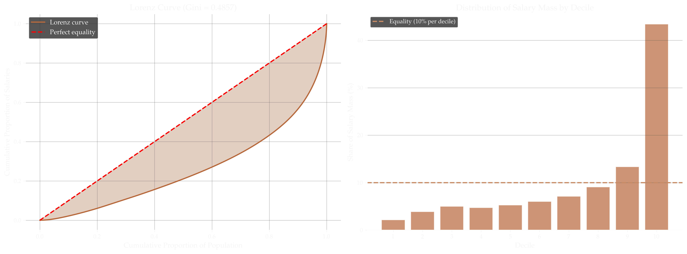
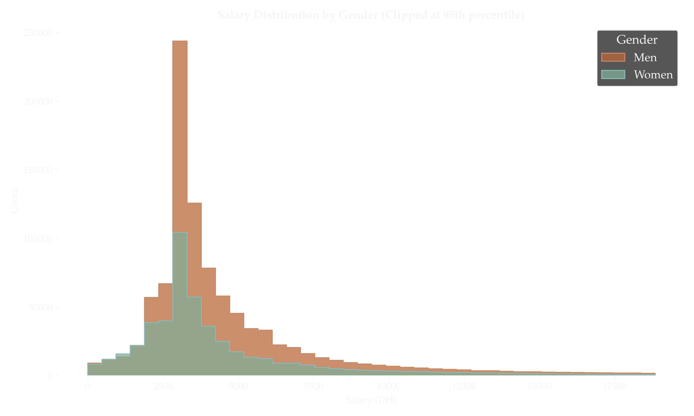
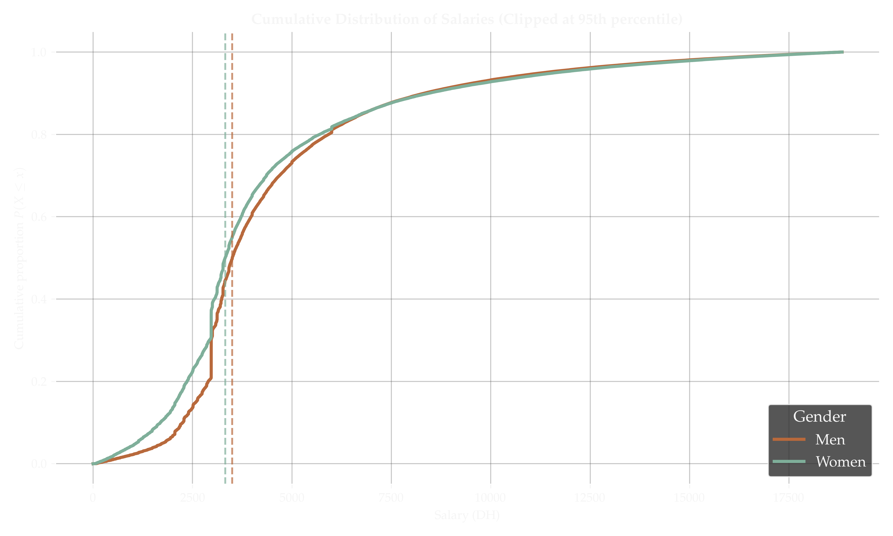
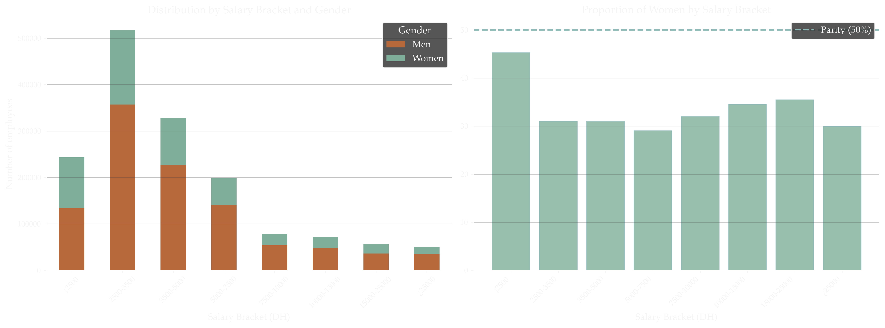
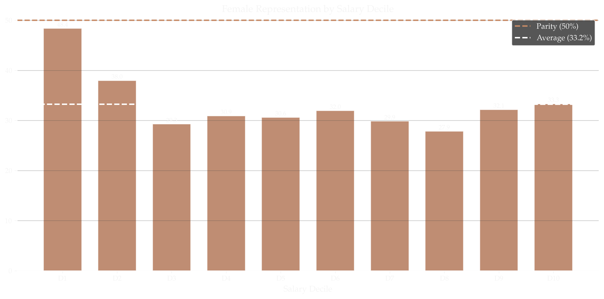
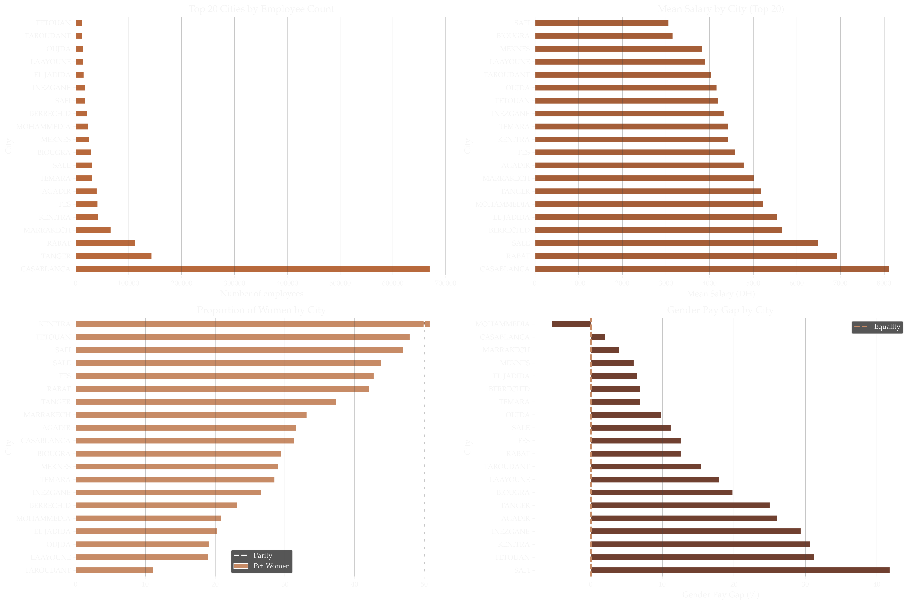
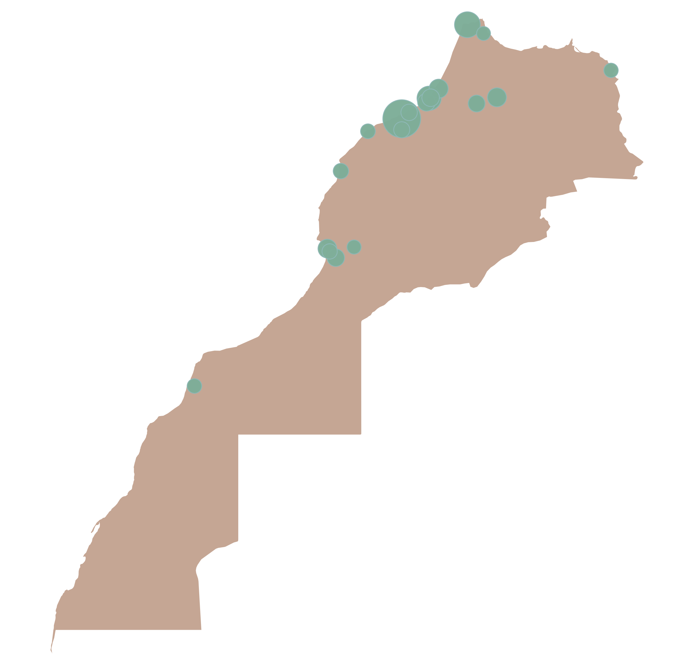
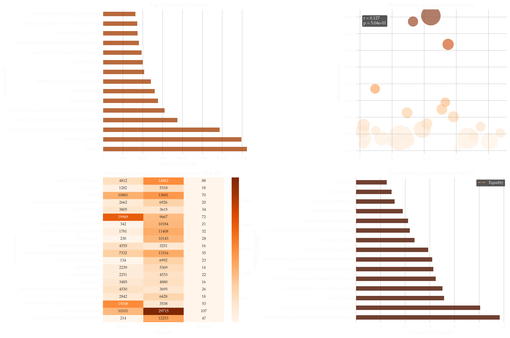

In 2022, the database of declared employees registered with Morocco's *Caisse Nationale de Sécurité Sociale* (CNSS) was leaked and made public. The database contains declared salaries, regional information, and economic activity sectors for approximately 1.6 million employees, offering an unusually detailed cross-section of Morocco's formal labor market.

After cleaning the data (removing entries with missing or inconsistent values), the working dataset contains **1,590,950 employees** spread across **160 cities**, **22,338 declared activity sectors**, and **40,184 companies**, representing 94.6% of the raw records. Gender was inferred from first names using a name-gender mapping dictionary, achieving a 97% match rate; 33.2% of identified employees are women.

## Salary Distribution

The headline figures already reveal a starkly unequal distribution:

| Statistic | Value |
|---|---|
| Mean salary | 6,279 DH/month |
| Median salary | 3,538 DH/month |
| 10th percentile | 2,099 DH |
| 25th percentile | 2,970 DH |
| 75th percentile | 5,669 DH |
| 90th percentile | 11,220 DH |
| 99th percentile | 48,170 DH |
| Maximum | 7,399,227 DH |

The gap between the mean (6,279 DH) and the median (3,538 DH) is a signature of a right-skewed distribution: a relatively small number of very high earners pulls the mean well above what most workers actually take home. More than half of formal-sector employees earn under 3,538 DH per month.

The **Gini coefficient is 0.4857** — classifying Morocco's formal-sector wage inequality as high by international standards, comparable to some of the most unequal economies in the world. The top decile captures **43.4%** of total declared wage mass; the bottom decile, just **2.2%**. The D9/D1 inter-decile ratio is **6.2x** — meaning the threshold to enter the top 10% of earners is more than six times the threshold at the bottom 10%.

::: {.column-screen-inset style="text-align: center;"}
{width="80%"}
:::

## Gender Pay Gap

The dataset shows a persistent and statistically significant gender pay gap across all salary metrics:

| | Women (515,118) | Men (1,031,308) |
|---|---|---|
| Mean salary | 5,863 DH | 6,483 DH |
| Median salary | 3,415 DH | 3,607 DH |
| 25th percentile | 2,728 DH | 2,970 DH |
| 75th percentile | 5,467 DH | 5,757 DH |

The mean-based gender pay gap stands at **9.56%** (women earn 90.4 cents for every dirham men earn), or **619 DH/month** in absolute terms — roughly 7,437 DH per year. The median-based gap is 5.32%. All three statistical tests applied (Student's t-test, Mann-Whitney U, Kolmogorov-Smirnov) confirm the difference is highly significant (p ≈ 0).

::: {.column-screen-inset style="text-align: center;"}
{width="60%"}
:::

::: {.column-screen-inset style="text-align: center;"}
{width="60%"}
:::

The gap is not uniform across the distribution. At a given salary level, the share of women drops as pay rises — women are overrepresented at the bottom of the distribution. In the lowest bracket (under 2,500 DH/month), women represent **45%** of workers; in brackets above 5,000 DH, they drop to around 29–35%.

::: {.column-screen-inset style="text-align: center;"}
{width="70%"}
:::

::: {.column-screen-inset style="text-align: center;"}
{width="60%"}
:::

## Geography

{.column-screen-inset fig-align="center"}

Morocco's formal labor market is heavily concentrated. **Casablanca alone accounts for 43.2%** of all registered employees (670,439 workers), and the top five cities — Casablanca, Tanger, Rabat, Marrakech, and Kénitra — together represent **66.7%** of the total workforce.

Salary levels vary significantly by city, with Casablanca leading by a wide margin:

| City | Mean salary (DH) | Median (DH) | % Women |
|---|---|---|---|
| Casablanca | 8,115 | 4,131 | 31.4% |
| Rabat | 6,929 | 3,561 | 42.2% |
| Salé | 6,496 | 3,227 | 43.8% |
| Tanger | 5,189 | 3,583 | 37.4% |
| Marrakech | 5,034 | 3,624 | 33.2% |
| Agadir | 4,788 | 3,479 | 31.6% |
| Fès | 4,586 | 3,300 | 42.8% |
| Kénitra | 4,439 | 3,362 | 50.8% |
| Safi | 3,066 | 2,863 | 47.1% |

{.column-page fig-align="center"}

The gender pay gap also varies substantially by city. The largest gaps appear in Safi (41.8%), Tétouan (31.2%), and Kénitra (30.7%). Mohammedia is the only major city where women's mean salary **exceeds** men's (by 5.5%), likely reflecting the specific industrial profile of that city.

{.column-screen-inset fig-align="center"}

## Sector Analysis

The most common declared activity sectors are dominated by temporary labor supply, garment manufacturing, banking, agricultural work, and automotive parts manufacturing. The spread in pay across sectors is enormous:

**Highest-paying sectors (mean salary):**

| Sector | Mean (DH) | % Women |
|---|---|---|
| Banking (BANQUE) | 18,140 | 44.2% |
| Engineering consulting | 17,448 | 33.1% |
| Banking operations support | 14,712 | 54.9% |
| Automotive vehicle sales | 9,395 | 9.5% |
| Multilingual telecom support | 7,777 | 53.2% |
| Call centers | 6,954 | 51.1% |

**Lowest-paying sectors (mean salary):**

| Sector | Mean (DH) | % Women |
|---|---|---|
| Labor/manpower supply | 2,400 | 60.9% |
| Agricultural exploitation | 2,713 | — |
| Security / guarding | 2,779–2,939 | ~3% |
| Tomato farming | 3,014 | — |
| Preschool education | 3,108 | 80.7% |

The pattern is stark: the most feminized sectors are also among the lowest-paid. Sectors with more than 60% female workforce — automotive parts manufacturing (87% women), preschool education (81%), garment manufacturing (67%), cable manufacturing (75%) — cluster at the bottom of the wage distribution. Conversely, the lowest-feminization sectors (construction, security, heavy industry) tend to pay more.

The sector-level gender pay gap follows a similar pattern: the largest gaps appear precisely in the most feminized industries, where women earn 50–58% less than men on average in the same sector.

{.column-screen-inset fig-align="center"}

## Employer Concentration

The labor market is highly fragmented. The **Herfindahl-Hirschman Index (HHI) is 18.34**, well below the threshold that would indicate concentration. The top 20 employers together account for only **14%** of total jobs. No single employer commands more than ~2% of the workforce.

The largest employers are dominated by temporary staffing agencies (TECTRA, 32,583 employees), agricultural conglomerates (SA STE MARAISSA, 19,782), automotive manufacturers (LEAR AUTOMOTIVE MOROCCO, 18,883), and the preschool education foundation FONDA MAROC (18,639).

The highest-paying companies tell a very different story, smaller, concentrated in finance, holding groups, and multinationals:

| Company | Mean salary (DH) | Employees |
|---|---|---|
| SIGER | 362,848 | 6 |
| AL MADA | 328,936 | 62 |
| ZALAR HOLDING | 238,692 | 21 |
| MICROSOFT MAROC | 183,574 | 35 |
| NAREVA HOLDING | 108,365 | 67 |
| AKWA GROUP | 92,180 | — |
| PHILIP MORRIS MAROC | 90,203 | — |
| COCA-COLA MAROC | 88,837 | — |

## The Top 1%

The top 1% of earners (15,505 individuals) sit above a threshold of **48,170 DH/month**, with a mean of **87,630 DH** and a maximum of **7,399,227 DH** — over 7.3 million dirhams per month, declared to CNSS.

The ten highest individual salaries in the database:

| Name | Monthly salary (DH) | Company |
|---|---|---|
| OURIAGLI MOHAMMED HASSAN | 7,399,227 | AL MADA |
| TAUD AYMANE | 3,611,795 | NAREVA HOLDING |
| TAZLAOUI ABDELMJID | 2,750,475 | STE ONAPAR AMETYS |
| KESSAR NOUFISSA | 2,465,852 | AL MADA |
| ZEMZAMI AISSA | 2,310,000 | FIRST MATERIEL SARL |
| EL MAJIDI MOHAMMED MOUNIR | 1,688,872 | ATELIER NUMERIQUE |
| HARAKAT HICHAM | 1,547,971 | SA STE MARAISSA |
| EL HABTEY RACHID | 1,462,105 | TOURISME ET D'ANIMATION |
| MAKRAM TARIQ | 1,340,529 | AL MADA |
| BAKKAL SANAA | 1,284,237 | AL MADA |

## Summary

A few structural features stand out from this dataset:

- **The median formal-sector salary in Morocco is 3,538 DH/month** — less than €320. More than half the registered workforce earns below this figure.
- **Inequality is high**: a Gini of 0.49 and a top decile capturing 43% of total wages. The formal labor market mirrors, and probably understates, the broader wealth distribution.
- **The gender pay gap is real, significant, and structural**: women are overrepresented in the lowest-paid sectors and brackets. The gap widens in the most feminized industries, not because women are in different jobs, but because the jobs that attract more women systematically pay less.
- **Geography concentrates opportunity**: Casablanca accounts for 43% of all formal employment and pays almost double the median salary of smaller cities.
- **The labor market is formally fragmented** but the top of the distribution is extremely concentrated — a handful of holding companies and multinationals account for the highest-earning individuals.
