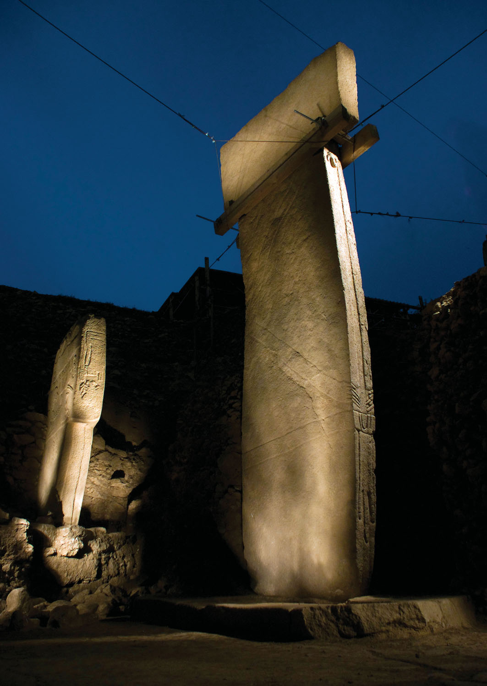
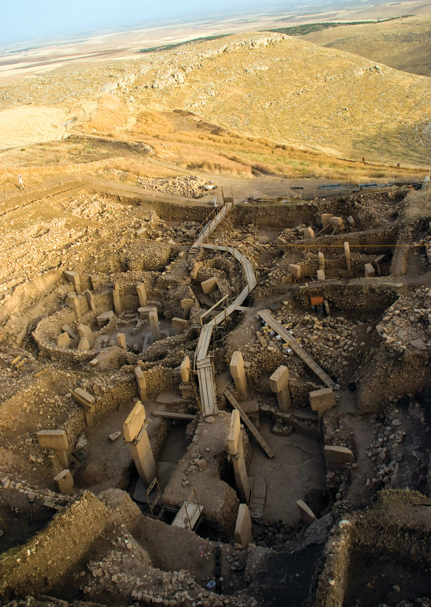
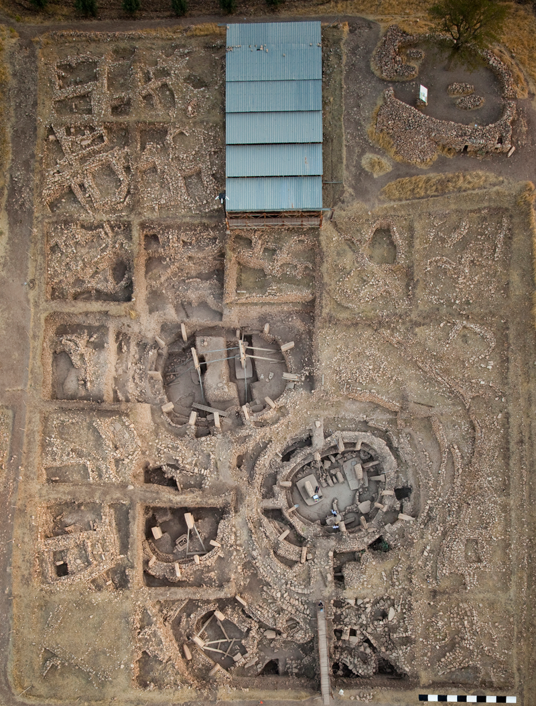
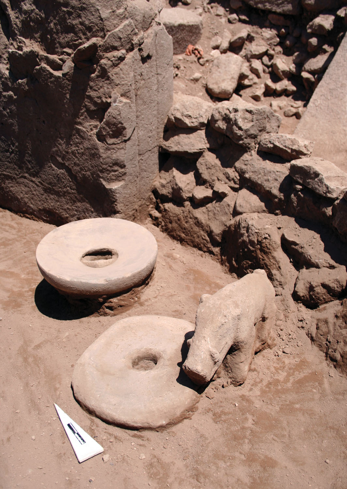
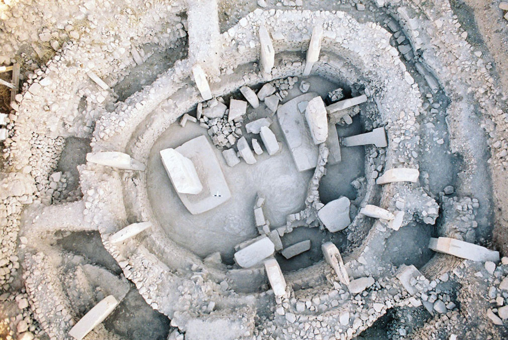
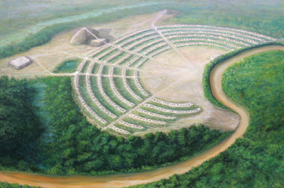
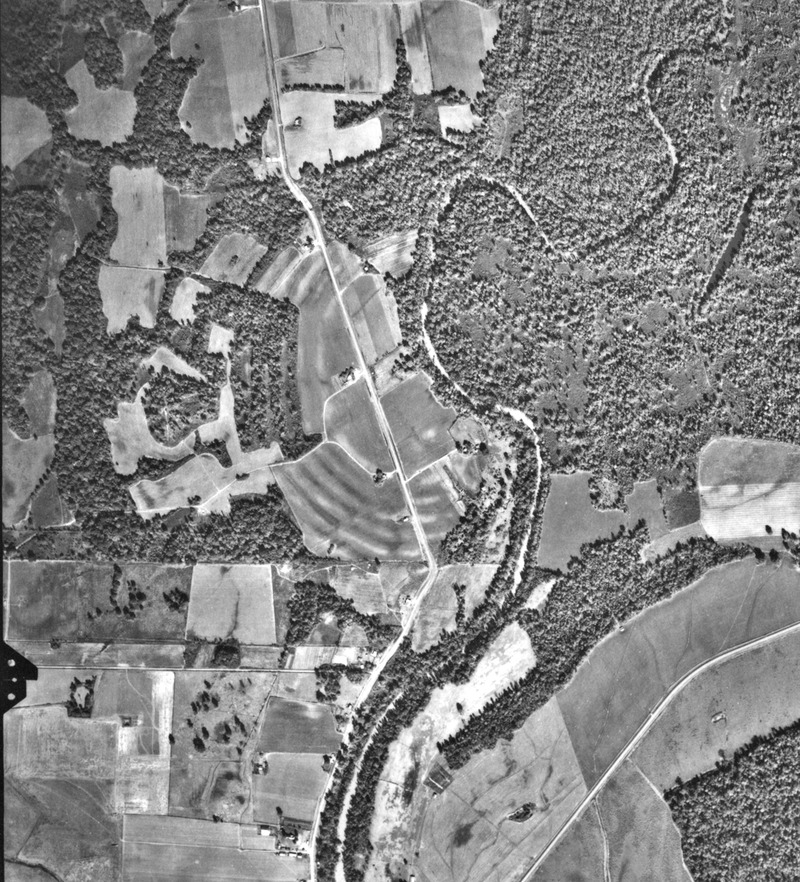
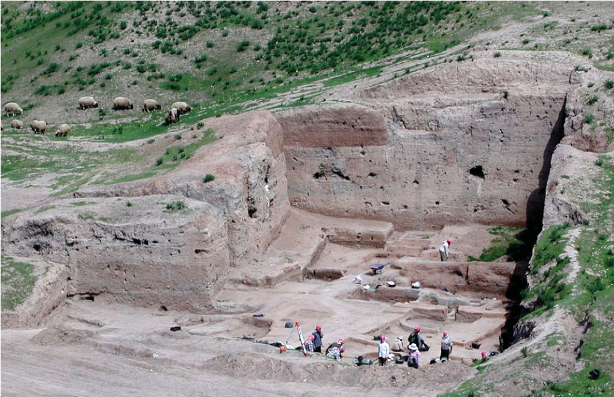

Just to set up the book and give some context on the dominant view on the broad sweep of human history and development (yes, I’m looking at you two pinker and Harrari). A chatbot answer to the question  “What is the neolithic revolution”  is the perfect example of what the book is criticizing:

> *The Neolithic Revolution, also known as the Agricultural Revolution, was a period in human history when people transitioned from a lifestyle of hunting and gathering to one of agriculture and settlement. This transition marked a significant change in human society and the way in which people lived.
> The Neolithic Revolution took place around 10,000 to 8,000 BCE, beginning in the Fertile Crescent, an area in the Middle East that includes modern-day Iraq, Jordan, Syria, Israel, Palestine, southeastern Turkey, and western Iran. It subsequently spread to other parts of the world.
> Before the Neolithic Revolution, humans lived in small, nomadic groups that relied on hunting wild animals and gathering wild plants for food. However, during the Neolithic Revolution, people began to cultivate crops and domesticate animals, which allowed them to form stable, settled communities. This was a major shift, as it allowed humans to control their food supply, leading to population growth and the development of complex societies.
> Key innovations of the Neolithic Revolution include:*
>
> 1. ***Agriculture:** Humans learned to cultivate plants, including wheat, barley, peas, and lentils. This meant they could stay in one place and accumulate a surplus of food.*
>
> 2. ***Animal Domestication:** Animals like goats, sheep, cows, and pigs were domesticated, providing a steady supply of meat, milk, and materials like leather and wool.*
>
> 3. ***Settlement:** The creation of permanent villages and later cities became possible due to the reliable food source.*
>
> 4. ***Technological Innovations:** New tools were developed for farming, including plows and irrigation systems. Additionally, pottery and weaving became common, and later on, metalworking was developed.*
> 
> 5. ***Social Organization:** With the surplus of food, not everyone needed to be involved in food production. This allowed for the emergence of different roles in society, leading to social stratification.*
> 
> *The Neolithic Revolution was a major turning point in human history, marking the start of the Neolithic Age and leading to the development of civilization. However, it also brought new challenges, including disease, social inequality, and environmental degradation.*


Here we go, bonne lecture:

<!-- divider -->
# 1 - Farewell To Humanity’s Childhood
(Or, why this is not a book about the origins of inequality)

- There are two common and widely accepted views on the social evolution of humanity and the origins of inequality:

    The first is the view of Jean-Jacques Rousseau in his “***Discours sur l'origine et les fondements de l'inégalité parmi les hommes” (1754)*** postulates that humanity initially existed in an idyllic, simple and egalitarian form of social organisation, tiny bands of hunter-gatherers, but fell from this state due to the advent of agriculture, which necessitated hierarchies, civilization and states. - page 1
    
    The second is the view of Thomas Hobbes, which is developed in his *Leviathan (1651)*, and held that due to the selfish nature of humans, their original state of existence was not innocent, but must have instead been ‘solitary, nasty, brutish and poor’. If any progress has been made from that state, it must be due to the same repressive mechanisms that Rousseau complains about.  - page 2

- These views, D&D argue, widely accepted they may be, are not actually backed up by any scientific evidence because the facts that are presented in support are not true, have dire political implications, are make the past *‘needlessly dull’.* - page 3

- D&D then explain how accepting either of these two views prevents questioning of the current status quo, which is currently fraught with inequality. Indeed, framing the problem solely in terms of ‘inequality’ leads to the belief that solving it entirely is hopeless and utopian, and that a realistic approach would focus on reducing the degree of inequality. In fact, attempting to enforce strict egalitarianism is equated with returning to the primitive initial state of humanity where everyone was ‘equally poor’ (page 6).

- D&D then criticize the work of Francis Fukuyama (*The Origins of Political Order*) and Jared Diamond (*The World Until Yesterday*) and Steven Pinker

    > *[In particular, recent discoveries suggest that the adoption of agriculture, supposedly our most decisive step toward a better life, was in many ways a catastrophe from which we have never recovered. With agriculture came the gross social and sexual inequality, the disease and despotism, that curse our existence.* - Jared Diamond](https://www.historyhaven.com/Diamond_WorstMistake.pdf)

- On page 14, D&D criticize Pinker for using Otzi the Tyrolean Iceman, who died with an arrow in his side in the Alps, as an example of humanity in its initial state. Instead, they briefly mention the much older burial of Romito 2 in southern Italy. Romito 2 suffered from dwarfism, but lived a relatively long and healthy life, likely due to the accommodation provided by his entourage. - page 14

- The authors then talk about Napoleon Chagnon’s sulfuric study of the Yanomami people as a ‘fierce people’ and how controversial his work is in anthropology - page 16

- D&D trace their argument back to Pinker, who asserts that institutions like the police, the state, and an ambiguous "European civilizing process" associated with the Enlightenment and Voltaire are the only things that prevented us from returning to a violent state. However, the authors challenge Pinker's view by pointing out that even Voltaire himself never claimed that our contemporary ideals of freedom, equality, and democracy were exclusively "Western" or of European origin. In fact, most Enlightenment thinkers attributed these ideals to foreigners. This is not surprising because "Western" authors from Plato to Marcus Aurelius almost always opposed such ideals. For example, despite the Greek origins of the term "democracy," all Western thinkers considered it to be a terrible form of government. - page 17

<!-- divider -->
# 2 - Wicked Liberty

- The Spanish conquests of the Americas and Portuguese fleets visiting Africa, China, and India exposed Europeans to a plethora of previously unimagined social, scientific, and political ideas. The ultimate result of this flood of new ideas came to be known as the Enlightenment.

- However, historians tell a different story. Even when great European thinkers themselves insist that they were getting their ideas from foreign sources (as was the case with Leibniz, for example), they are not taken seriously by historians. Only references to other Western thinkers are usually considered valid.

- As an example, the authors cite the case of Leibniz. He advocated for Chinese models of statecraft, which had existed for centuries in China but became more common in Europe when exposed to Chinese thought and experiences.

- D&D suggest that Europeans may have taken inspiration for their ideas about freedom, liberty, and reason from Native Americans. Specifically, they suggest that Kondiaronk, a Wendat statesman, may have greatly influenced salon discussions in 17th century Europe through the writings of Lahontan, a French aristocrat who served in the French army in North America. The writings were presented as a discussion with "*Adario*" in the book *"Curious Dialogues with a Savage of Good Sense Who Has Travelled (1703)"* - up to page 52.

- Some excerpts from the conversation by the channel MakingHistory:
```{=html}
    <div style="display: flex; justify-content: center;">
      <iframe width="680" height="420" src="https://www.youtube.com/embed/hLwj-4GI9_Q" title="YouTube video player" frameborder="0" allow="accelerometer; autoplay; clipboard-write; encrypted-media; gyroscope; picture-in-picture; web-share" allowfullscreen></iframe>
    </div>
```

- On page 55, there is an amazing paraphrase of Kondiaronk's description of what he would do if he lived in Europe.

- According to the authors, Lahontan's book inspired a whole genre of imitations, including one by Madame de Graffigny, a saloniste, titled "Letters of a Peruvian Woman." The main character, Zilia, is a kidnapped Inca princess who is critical of the absurdities of European society and the patriarchy. Some consider this work to be the first to introduce state socialism to Europe, as Zilia wonders why the king simply doesn't redistribute all the wealth he garners from the heavy taxes he levies, just like the Sapa Inca.

- Moreover, the authors note how de Graffigny sent a copy of her book to friends for suggestions and changes. One of these correspondents was *A.R.J. Turgot*, an economist and Louis XVI's [Contrôleur général des finances](https://fr.wikipedia.org/wiki/Contr%C3%B4leur_g%C3%A9n%C3%A9ral_des_finances), who argued that while freedom and equality are good in principle, they are only possible in "primitive societies that have not yet moved on from hunting and gathering or farming." A complex "commercial civilization" requires a certain division of labor that highlights the differences between individuals. The authors (probably?) suggest that this is the origin of the "equally poor" argument and note it as an explicit example of American critique of European society that directly provoked a debate in Europe around a central idea of the Enlightenment: Equality. (Pages 59-62)

- Note that every central figure of the enlightenment had an external character critique European society Lahontan-style:
    - A Persian for Montesquieu *(Lettres persanes)*
    - A Chinese for the Marquis d’Argens
    - A Tahitian for Diderot
    - A Natchez for Chateaubriand
    - A half-Wendat and half-french in Voltaire’s *L’Ingénu*

- Up to page 75, the authors spend time to develop why the question about the origin of social inequality is necessarily a question about the origin of human civilization. It is therefore unhelpful to consider our ancestors as some sort of primordial egalitarian human soup, but as people who had very specific ideas about what was going on in their societies and what they wanted from it.

<!-- divider -->
# 3 - Unfreezing the Ice Age

- The humans that inhabited Africa from Morocco to the Cape for hundreds of thousands of years (most of our prehistory) are far more diverse than humans today. Populations separated by deserts of rainforests were isolated from each other, allowing for the development of strong regional population traits. The difference we notice now are largely illusory and are due to having no real basis for comparison. - page 80 to 81

- Our ancestors also lived with small-brained, more ape like species such as **Homo naledi**, They exchanged with them, interbred with them, drifted away from them etc. But we have no idea what these ancestral societies must have been like. The variance of societies must have been at least as important as the variance in physical types. - page 81

- This was the case up until at least *40,000B.C.* It is therefore useless to look for a singular form of human societies in our deep prehistory, and trying to do so is a matter of myth-making only - page 82

- Funny phrase from page 83:

> Consider the first direct evidence of what we’d now call *Complex Symbolic Human Behavior*, or simply ‘Culture’

- The earliest hafted tools and expressive use of shell and ochre date back to *80,000B.C* in Rock Shelters around the coastlands of South Africa. However, it’s only until ***45,000B.C*** that such [evidence starts to appear widely](https://www.worldatlas.com/articles/what-was-the-upper-paleolithic-revolution.html) and on a larger scale. Scientists interpreted this is the revolution in human cognition that paved the way for civilization, but current evidence now suggests that it is only an illusion due to bias in the data.

- The authors explain this by the fact that most of this evidence is based in Europe where the Homo Sapiens replaced the Neanderthals. And go on to talk about the *‘Sapient Paradox’:*
delay between when our biological development is supposed to have given us the means to develop culture, and the time when we got around to actually doing it. - page 84

- Emerging evidence from all around the world is now showing behavioral complexity even earlier than what the European findings showed, the problem was therefore a mirage.

- In the pages following 85, the authors cite a few of the rich hunter-gatherer burial discoveries that indicate hierarchies and stratification in humans around 30,000 years ago. They cite:

> *Pettitt, P. (2011). Religion and ritual in the Lower and Middle Palaeolithic. The Oxford handbook of the archaeology of ritual and religion, 329-343.*


```{=html}
<iframe src="insoll.pdf" width="100%" height="600px" style="border:none;"></iframe>
```

- These findings have apparently swung the pendulum completely into the other direction, with some archeologists now arguing that human societies before the advent of farming and agriculture were very stratified - page 88

- There is also the appearance of Monumental Architecture, with the temples at Gobekli Tepe (Schimdt, 2006) which is talked about in:

    > [*https://www.dainst.blog/the-tepe-telegrams/*](https://www.dainst.blog/the-tepe-telegrams/)

- Other examples include the stone temples in the Germus mountains in southeast Turkey which are extremely ancient

- The massive structures at Gobekli Tepe are massive and imply strict coordination on a large scale, even more so if they were built simultaneously, as is claimed by

    > *Haklay, G., & Gopher, A. (2020). Geometry and architectural planning at Göbekli Tepe, Turkey. Cambridge Archaeological Journal, 30(2), 343-357.*








- The main point to stress is that while some humans in the vicinity had begun cultivating crops, it does not seem like 
the humans who built these monuments had. This is the most striking example of monumentality beyond the emergence of 
agriculture.

> *Hunter-Gatherer societies had institutions to support major public works, projects and monumental constructions, and therefore had complex social hierarchy prior to their adoption of farming -* page 90

- Page 93 contains a citation from Yuval Noah Harari’s book "Sapiens", in which he compares early bands of humans to apes instead of humans. This comparison suggests, according to the D&D, that he is stripping these early humans of conscious political thought. Like apes, they didn't choose to live the way they did, and cannot argue or reflect on the proper way to live.

- This causes a paradox, humans somehow had developed anatomically modern brains, but for long periods of history, simply lived like apes anyway?

- Claude Levi-Strauss also observed the Nambikwara in the amazon forest, who during the rainy season settled in villages due to the abundance of resources, but during the dry season  split into bands that were led in an autocratic fashion by leaders who would switch back to being nothing but mediators and diplomats that had no coercive power. The Nambikwara were switching constantly between two different stages of human development that should not be able to simultaneously exist. Not to mention that the dry-season leaders were able to change their behavior depending on the situation, which means they must have been quintessentially political actors that could reflect about their own society. - page 98 to 100

- In page 102, the authors claim that there is also overwhelming evidence of seasonal variations in the social structures of human societies in the paleolithic period.

- Marcel Mauss apparently talked about this phenomenon and called it *“double morphology”*

>Mauss, M. (2013). *Seasonal variations of the Eskimo: a study in social morphology*. Routledge.

- pages 107-110 talked about more examples of this seasonal variations and in page 112 talk about how it implies that they are full political actors that could imagine and seek/avoid different kinds of social order. In fact, it seems as if the way some of these societies were organized was precisely to avoid the emergence of the coercive institutions of an “advanced complex society” such as state”. A possible critique of this is that it’s farfetched to think that these humans would try to avoid something they’d never lived in or seen? Authors answer that large scale polities did exist in neighboring regions in the continent and it’s not unreasonable to think that they were aware of what was going on in them.

- In 114, authors say that this phenomenon of seasonality is a bit of a wildcard and there is no common pattern in the way it manifests itself in these foraging societies. The only constant is variation and the *consequent awareness of different social possibilities*.

> *What all this confirms is that searching for ‘the origins of social inequality’ is really asking the wrong question - page 115*

- An interesting idea in page 117 is that the rituals associated with seasonality are also highly variable, and even in modern humans where it is a shadow of its former self and the possibilities they offer, keep the imagination of the political mind alive by showing different kinds of possible social orders. Authors think it’s no coincidence that May Day or  International Workers’ Day for example is because many British peasant revolts began on riotous festivals at that season.

- Maybe the first Kings to ever exist were just play kings in some ritual or festival, who then became real kings, and are now going back to being play kings again who are largely ceremonial in role.

- Page 118 is a good summary of the book so far, and is important, so here it is in its entirety

> *WHAT BEING SAPIENS REALLY MEANS*
>
> *Let us end this chapter where we began it. For far too long we have been generating myths. As a result, we’ve been mostly asking the wrong questions: are festive rituals expressions of authority, or vehicles for social creativity? Are they reactionary or progressive? Were our earliest ancestors simple and egalitarian, or complex and stratified? Is human nature innocent or corrupt? Are we, as a species, inherently co-operative or competitive, kind or selfish, good or evil?*
> 
> *Perhaps all these questions blind us to what really makes us human in the first place, which is our capacity – as moral and social beings – to negotiate between such alternatives. As we’ve already observed, it makes no sense to ask any such questions of a fish or a hedgehog. Animals already exist in a state ‘beyond good and evil’, the very one that Nietzsche dreamed humans might also aspire to. Perhaps we are doomed always to be arguing about such things. But certainly, it is more interesting to start asking other questions as well. If nothing else, surely the time has come to stop the swinging pendulum that has fixated generations of philosophers, historians and social scientists, leading their gaze from Hobbes to Rousseau, from Rousseau to Hobbes and back again. We do not have to choose any more between an egalitarian or hierarchical start to the human story. Let us bid farewell to the ‘childhood of Man’ and acknowledge (as Lévi-Strauss insisted) that our early ancestors were not just our cognitive equals, but our intellectual peers too. Likely as not, they grappled with the paradoxes of social order and creativity just as much as we do; and understood them – at least the most reflexive among them – just as much, which also means just as little. They were perhaps more aware of some things and less aware of others. They were neither ignorant savages nor wise sons and daughters of nature. They were, as Helena Valero said of the Yanomami, just people, like us; equally perceptive, equally confused.*
> 
> *Be this as it may, it’s becoming increasing clear that the earliest known evidence of human social life resembles a carnival parade of political forms, far more than it does the drab abstractions of evolutionary theory. If there is a riddle here it’s this: why, after millennia of constructing and disassembling forms of hierarchy, did Homo sapiens – supposedly the wisest of apes – allow permanent and intractable systems of inequality to take root? Was this really a consequence of adopting agriculture? Of settling down in permanent villages and, later, towns? Should we be looking for a moment in time like the one Rousseau envisaged, when somebody first enclosed a tract of land, declaring: ‘This is mine and always will be!’ Or is that another fool’s errand?*

<!-- divider -->
# 4 - Free People, the Origin of Cultures, and the Advent of Private Property

- Up to 125, authors talk about various mesolithic populations and how the gradual improvement of technologies that would in principle make it easier to travel long distances (connecting populations with different languages and economic systems etc.) resulted mainly in more tightly knit groups divided across cultures, class and language.

- Surprisingly, in page 124-125, authors seem to suggest that this emergence of distinct social and cultural universes might have led to more durable and intransigeant forms of domination.

- The constantly mobile nature of foraging societies meant that individuals could take the first exit route if their freedoms were threatened, the hardening and multiplication of cultural boundaries might have restricted this possibility - 125

- Then there is a discussion on Marshall Sahlin’s *‘Original Affluent Society’* which according to wikipedia:

> *At the time of the symposium new research by anthropologists, such as [Richard B. Lee](https://en.wikipedia.org/wiki/Richard_Borshay_Lee)'s work on the [!Kung](https://en.wikipedia.org/wiki/!Kung_people) of [southern Africa](https://en.wikipedia.org/wiki/Southern_Africa), challenged popular notions that hunter-gatherer societies were always near the brink of [starvation](https://en.wikipedia.org/wiki/Starvation) and continuously engaged in a struggle for survival.[2](https://en.wikipedia.org/wiki/Original_affluent_society#cite_note-barnard-2) Sahlins gathered the data from these studies and used it to support a comprehensive argument that states that hunter-gatherers did not suffer from [deprivation](https://en.wikipedia.org/wiki/Poverty), but instead lived in a society in which "all the people's wants are easily satisfied."*

> Sahlins, M. (1968). "Notes on the Original Affluent Society", _Man the Hunter._ R.B. Lee and I. DeVore (New York: Aldine Publishing Company) pp. 85-89.[ISBN](https://en.wikipedia.org/wiki/ISBN_(identifier) "ISBN (identifier)") [020233032X](https://en.wikipedia.org/wiki/Special:BookSources/020233032X "Special:BookSources/020233032X")
 
- In 138, there is this important paragraph where they argue that in the 1960s, researchers were beginning to realize that foragers were perfectly aware of how one would go about planting and harvesting grains and vegetable, but simply did not see any reason to. They cite a !Kung informant who said

>*Why should we plant, when there are some many mongongo nuts in the world?*    > 

- Such foragers literally rejected the Neolithic Revolution in order to keep their leisure

<!-- divider -->

I interrupt these notes to pose my own prediction of how Graeber and Wengrow will end this book, and I will confirm whether I was right when I actually finish it, here goes:

The Neolithic Revolution is probably a conscious political decision that early humans made. I’m not sure yet why, but once settlements and coercive institutions emerged, they could amass enough surplus production using these coercive institutions (note that the concept of surplus is pointless to a foraging people) to dominate the other groups and populations that hadn’t made the transition and excluding them from territory or incorporating them in their own system. Once ‘civilization’ was spread enough on most accessible land, these foraging groups either had to submit to the new emerging stratified surplus societies (or statelike structures) or adopt their own in order to keep a distinct identity and survive. (Inspired by current touareg populations in the Sahara and special shoutout to the music video of Tinariwen **(+IO:I) - Ténéré Tàqqàl**)

```{=html}
  <div style="display: flex; justify-content: center;">
    <iframe width="700" height="315" src="https://www.youtube.com/embed/boiiiVh52v4" title="YouTube video player" frameborder="0" allow="accelerometer; autoplay; clipboard-write; encrypted-media; gyroscope; picture-in-picture; web-share" allowfullscreen></iframe>
  </div>
```

Am I right or am I wrong?

<!-- divider -->

- Authors then proceed to point out what they consider to be the main flaw in Sahlin’s argument, that he himself concedes, which is that maybe the !Kung were not necessarily more representative of paleolithic societies than the foragers of Northwestern California or the fisher-foragers of the Canadian northwest coast, who were famously industrious and adhered to a stringent work ethic. The Kwakiutl also had lavishly supplied households with a an always increasing quantity of items

- Next is a discussion about [Poverty Point](https://en.wikipedia.org/wiki/Poverty_Point), which apparently has evidence of standardised units of measurements across a significant proportion of the Americas - 143

- Artist reconstruction of Poverty Point:

{fig-align="center"}

- An aerial view of the earthworks at Poverty Point. Excerpt from USDA Agricultural Stabilization and Conservation Service aerial photograph CTK-2BB-125. Aerial photograph taken November 11, 1960:


- 145 contains new (to me at least) information about the archaic period of american prehistory:

> *The Archaic period covers an immense span of time, between the flooding of the [Beringia land bridge](https://en.wikipedia.org/wiki/Beringia) (which once linked Eurasia to the Americas)  around 8000BC, and the initial adoption and spread of maize-farming in certain parts of North America, down to around 1000BC.*

- The myth that foraging societies live in a state of infantile simplicity was used to strip native populations of the land they forage in, with the argument that they didn’t ***really*** improve the land (like a landlord would) but only used to for their basic needs. They were considered part of the land and had no right to claim property to it. - 149

- 151 mentions the Calusa, a non-agricultural people who inhabited the west coast of Florida. The Leader had absolute political power and was even dressed like a king with a wooden throne. This people clearly had a stratified society with extreme coercion, without ever needing to plant a seed or tethering a single animal.

- 158 to 159 go back to the subject of property. An apparently striking exception to the rule of never claiming property was the sacred or rituals. They cite James Woodburn’s work on ***free societies***  and how the items associated with these rituals are the only objects that can be exclusive in nature. Next, they pivot to Emile Durkheim’s definition of the ‘sacred’ as that which is set apart, or the Polynesan word ***‘Tabu’*** which means *that which is not to be touched.*

- D&D consider this perfectly analogous to private property as we know it today, at least in its social effects and underlying logic. If you own a car, you have the right to keep anyone in the entire world from entering it, it is sacred to a specific human individual, you, at the expense of the rest of the world.

- Furthermore, the european conception of the absolute and sacred nature of property is taken as a paradigm for all other rights and freedoms. In the sense that you own your right to safety stems from you owning your house and your right not to be killed, tortured or arbitrarily from you owning your body. Naturally the people who did not share this conception of the sacred could be killed, imprisoned or tortured, as they often were.

- 162 to 163, D&D talk about brutal initiation rituals in Australian Aranda people, and the in general, the idea of the sacred is intimately related to exclusive claims to rights over property, and places like Gobelki Tepe and Poverty Point are exactly the kind of places where sacred rituals would happen. The question therefore, of the origin of property as a concept is probably associated with the origin of the sacred, which is as old as humanity itself. The right question to ask, then, is how it came to order to many so many other aspects of human affairs.

<!-- divider -->
# 5 - Many Seasons Ago

(or the problem of modes of production)

- 170 to 174 are about culture areas and Mauss’ insight about how different populations were broadly aware of what was going on around them, but chose not to adopt some elements precisely as a way to differentiate themselves from them.
 
> Cultures were, effectively, structures of refusal

- In their discussion about foraging societies in the west coast (California and Northwest coast), authors mention Maz Weber’s ***The Protestant Ethic and The Spirit of Capitalism - 1905,*** which was trying to ask why capitalism emerged in western europe and not elsewhere. Weber apparently says that despite trade an commerce existing elsewhere in the world, their was always the expectation that you would use the wealth you gained to get yourself a palace or build a mosque etc. but this wasn’t the case with capitalism, where the wealth one gains is always expected to be reinvested to generate even more wealth, which would put the person under immense pressure from their community in any other place the puritanical strain of Christianity.

- 179 to 180 discuss the different ethos between the indigenous californians and the peoples of the NorthWest coast. While they both had advanced concepts of private property and it was possible to accumulate a certain quantity of wealth, the underlying ethos was very different in that a wealthy Californian (Yurok) was expected to remain modest and give much of his wealth away in festivities and such, while in the north west coast the Kwakiutl was much more boastful and vainglorious. In 180 there is a systematic extrapolation to this process of differentiation with the main example given being how Sparta and Athens were always diametrically opposed in so many facets they came to define eachother as land does with sea. Marshall Sahlins’ puts it this way

> *Dynamically interconnected, they were then reciprocally constituted.. Athens was to Sparta as sea to land, cosmopolitan to xenophobic, commercial to autarkic, luxurious to frugal, democratic to oligarchic, urban to villageois, autochtonous to immigrant, logomanic to laconic, .. One cannot finish enumerating the dichotomies … Athens and Sparta were antitypes.*
 
- In 183, the authors ask how we could explain the differences between the Californians and the Northwest coast peoples. Does one start from institutional structures and arrive at the ethos from that, or is it the other way around, with the institutions deriving from the underlying ethos? Are they both just the effects of technological adaptation to different environments?

- These are fundamental questions about what ultimately determines the nature of society

- Book moves on to the subject of slavery and modes of production, by first noting that it’s very hard to archeologically ‘identify’ slavery without written records. However:

> *We can observe how the elements that came together to form the institution of slavery emerged at the same time starting at around 1850BC,in what’s called the middle pacific period*

- Basically increased labour demands from such a bounteous resource as anadromous fish with large salmon runs. It’s assumed to be no coincidence that the first signs of warfare and fortifications emerged at the same time. - 186

- They also observe a significant variation between treatment of the dead at this stage, with clear hierarchy between those who’s burials had decoration and ornamentation, and those who’s bodies were mutilated, used as tools or in general shown to matter very little.

- This was completely absent in the correspondingly early record of California, who’s middle pacific was comparatively more ***pacific.*** And the differences cannot be put down to lack of contact, which archeological and linguistic evidence suggests definitely did exist through the movement of people and goods along the west coast.

- Authors talk about the deep ambivalence of some relationships with slaves. In a first sense, slavery is taken as theft of labour in which one does not have to raise a human up to adulthood where they cease to be a liability and start actually becoming productive. Why is it then that some societies take pride in their adoption of captives and spending a lot of effort, almost like pets. 191

- 192-193, the story of the wogies: First attested in 1873 by A.W. Chase. which was related to him by the Chetco people of Oregon. Wogie is a word for white settlers, and the story goes like this:

> The ancestors came with canoes from the far north, and found two tribes in the area. One warlike race, which they conquered and exterminated, and one tribe with a diminutive and mild disposition. They were skillful in the manufacture of baskets, robes, canoes etc. but were enslaved because of their refusal to fight. One night after a grand feast, they packed up their things and fled.
> When the first white mean appeared, the Chetcos thought the were the wogies returned, but they soon found out their mistake, but retained the appellation ‘Wogies’

- The authors not that the Chetcos enslaved a tribe for their labor and skills that they themselves lacked, similar to the Guaicuru . Furthermore, this story seems like a cautionary tale from the dangers of enslaving a people, since the Chetco consider the white european settlers as the Wogies back for their vengeance. More interestingly, however, this was geographically in the boundary between two major culture regions, precisely where one would expect an institution like slavery would be debated and contested. 

- 195, authors describe optimal foraging theory:
  > ***foragers will design their hunting and collecting strategies with the intention of obtaining the maximum return 
  > in calories, for a minimum outlay of labor.***

- Behavioral-ecologists call this a ‘cost-benefit’ calculation. First you figure out how foragers ought to act if they are trying to be as efficient as possible. Then you examine how they do in fact act. If it doesn’t correspond, then something else must be going on.

- Authors note that in this perspective, indigenous californians were far from efficient. They were gathering acorns and pine nuts as staples, which doesn’t make sense in a bounteous region like California. Nut yields vary dramatically from season to season, unlike the reliably abundant and more nutritious fish. Acorns and pine nuts also require a lot of leaching and grinding. In fact, the Northwest coast peoples did enjoy great varieties of fish, so in optimal foraging theory, California is a puzzle

- In behavioral ecology, fish are ‘front-loaded’, meaning you have to do most of the work right away, unlike acorns and pine nuts which were ‘back-loaded’. Harvesting them was a simple task, and there was no need for processing prior to storage. Unlike fish, most of the hard work came right before consumption: grinding and leaching to make porridges, cakes, and biscuits. Fish on the other hand, means investing in the creation of a storable surplus of processed and packaged foods, which creates an irresistible temptation for plunderers; you were basically tying a noose around your own neck.
  
- It seems then, that Northwest coast societies were warlike simply because they didn’t have the option of relying on a war-proof staple food. But the authors claim that this theory does not match up to the historical record. First, because the capture of fish or dried food was never a significant aim of Northwest coast  intergroup raiding. The main aim of raiding was always to capture people, but this was one of the most densely populated areas of NA. Why this hunger for people then? - 197
  
- It seems the causes of slavery stem from Northwest coast concepts of the proper ordering of society, which in turn, were the result of political jockeying by different sectors of the population on what a proper society should be. Aristocratic title holders felt that they should be exempt from menial work, which became issues in spring and summer when the only limit on fish harvesting was how many hands were available. But low ranking commoners would constantly defect to rival households if pressed too hard.
  
- There seems to be a shortage of *controllable* labor especially during critical times of the year. This seemed to be the problem that slavery solves for the aristocrats. They looked abroad, because they lacked the means to compel their own subjects to take part in their endless games of magnificence.
  
- 200 - The cautionary tale of the Wogies suggests that populations directly adjacent to the Californian ‘shatter zone’ were aware of their northern neighbors and saw them as warlike. Meaning they recognized such exploitation as a possibility in their own society and still rejected it. In fact, the foragers in the Californian shatter zone were building their communities in a schismogenetic fashion: You’d never catch a free member of a Northwest household chopping or carrying wood, but Californian Chiefs made such activities into solemn public duty
  
- *Some Conclusions* in page 204 is a good summary in itself, and a must reread. Especially the part where slavery is considered to gave emerged at home.
  
- Re-examine the second paragraph in page 205 about the role of structuralism and post-structuralism

<!-- divider -->
# 6 - The Gardens of Adonis
**The revolution that never happened: How neolithic peoples avoided agriculture.**

212 - a discussion about the world’s oldest town: ***Çatalhöyük***

On-site restoration of a typical interior.


Model of the neolithic settlement ( 7300 BC )


```{=html}
<video width="100%" controls style="border-radius:8px;">
  <source src="Catalhöyük.webm" type="video/webm">
</video>
```


Population 5,000 - 7,000. Large numbers of buildings clustered together. The inhabitants lived in mudbrick houses. No footpaths or streets between the dwellings. Most were accessed by holes in the ceiling and doors on the side of the houses, with doors reached by ladders and stairs.

- The town is important in that it is the first settlement that we know of whose inhabitants got most of their nutrition through domesticated cereals, sheep and goats.
  
- 213-214, discussion about **primitive matriarchy** and how new methods of field work in Çatalhöyük changed our perspective, buildings previously thought to be shrines are actually households where everyday tasks are performed, and wall-mounted Ox skulls that we thought to be those of domesticated cattle, turn out to be of fierce aurochs etc.
  
- 215 is about *[Matilda Joslyn Gage](https://fr.wikipedia.org/wiki/Matilda_Joslyn_Gage)* and her work in ***“Woman, Church, and State” - 1893*** in which she posits the universal existence of an early form of society known as “The Matriarchate” or “Mother-rule” in which institutions of government and religion were modeled after the relationship of a mother and her child in a household.
  
- 216-217 are about *[Marija Gimbutas](https://en.wikipedia.org/wiki/Marija_Gimbutas)*, a Lithuanian-American archeologist and her work in “***The Goddesses and Gods of Old Europe” - (1982)***, in which she argued for the old Victorian story of goddess-worshipping farmers, and that from 7000BC to around 3500BC, an ensemble of peaceful neolithic villages existed in the Balkans and eastern Mediterranean where women and men were equally valued, and worshipped under common pantheon of a supreme goddess, whose cult is attested in many female figurines across the middle east and Balkans.
  
- This came to a catastrophic end after the migration of the ***kurgan*** cattle-keeping peoples from the Pontic Steppe north of the Black Sea. They were extremely warlike and very patriarchal and their societies were based on the radical subordination of women and the elevation of warriors as a ruling caste.
  
- Gimbutas considers them to be responsible for the [westward spread of Indo-European languages]([https://en.wikipedia.org/wiki/Kurgan_hypothesis](https://en.wikipedia.org/wiki/Kurgan_hypothesis)). This was extremely controversial at the time and she was accused of muddying the waters between research and old Victorian myths. Recent DNA analyses however, indicate that she was probably right. It truly does seem that there was a migration of cattle herders from the north Black Sea at around the third millenium BC.

> Haak, Wolfgang, et al. "*Massive migration from the steppe was a source for Indo-European languages in Europe.*" *Nature* 522.7555 (2015): 207-211.

> Allentoft, Morten E., et al. "*Population genomics of bronze age Eurasia*." *Nature* 522.7555 (2015): 167-172.

> Mathieson, Iain, et al. "*Genome-wide patterns of selection in 230 ancient Eurasians*." *Nature* 528.7583 (2015): 499-503.

In a discussion about the origins of farming, page 230, authors criticize Yuval Harrari:

> *.. Wheat was just another form of wild grass, of no special significance; but within the space of a few millennia it was growing in large parts of the planet. How did it happen? The answer, according to Harrari, is that wheat did it by manipulating Homo sapiens to its advantage. ‘This ape’, he writes, ‘had been living a fairly comfortable life hunting and gathering until about 10,000 years ago, but then began to invest more and more effort in cultivating wheat.’ If wheat didn’t like stones, humans had to clear them from their fields; if wheat didn’t wanna share its space with other plants, people were obliged to labor under the hot sun weeding them out; if wheat craved water, people had to lug it from one place to another, and so on. -* p. 80 of *‘Sapiens’*

- Page 232, authors argue that under experimental conditions, it seems that the genetic mutations that would transform wheat from a wild form of grass into a domesticated plant take roughly 20 to 30 years, or 200 years at most, using simple harvesting techniques.
  
- It seems humans settled in permanent villages long before cereals became a major component of their diets:

> *Moore, A. M., & Hillman, G. C. (1992). The Pleistocene to Holocene transition and human economy in Southwest Asia: the impact of the Younger Dryas. American Antiquity, 57(3), 482-494.*

If Harrari’s claim was true, the domestication of large seeded grasses would have happened within a few decades, which contradicts available evidence that suggests a time frame of 3000 years for it to fully complete:

> *Fuller, D. Q., Allaby, R. G., &  Stevens, C. (2010). Domestication as innovation: the entanglement of techniques, technology and chance in the domestication of cereal crops. World archaeology, 42(1), 13-28.*

- 237 to 241 discuss the prominent role of women in the development of neolithic technology. Women were instrumental in exploring plant properties, experimenting with harvesting techniques, and debating the social implications of these practices. Moreover, women likely developed fibre-based crafts and industries, and the mathematical and geometrical knowledge linked to these crafts. Despite this, the text argues that the role of women is often overlooked in scholarly discourse.
  
- Moreover, The terms 'agriculture' and 'domestication' might not adequately describe early human interaction with the environment. The Neolithic relationship between people and plants is posited as being about creating garden plots, tipping the ecological balance in favor of desired species. This Neolithic mode of cultivation was successful, fostering population growth in lowland regions of the Fertile Crescent. The visibility of women in contemporary art and ritual might reflect their status and achievements in these societies. The beginnings of farming are a media and social revolution, with women's work and knowledge at the core. Furthermore, it emphasizes that this process was leisurely, non-coercive, and led to equality, unlike traditional narratives that imply it was born out of necessity.

<!-- divider -->
# 7 - The Ecology of Freedom

How farming first hopped, stumbled and bluffed its way around the world

- 250, there’s been many instances of societies transitionning from foraging to agriculture (over long stretches of time of course, where they effectively tried different forms of foraging and farming), therefore it doesn’t make sense to ask the question “***what are the social implications of the transition to farming”*** as if there’s only on set of possible implications.
  
- Transition to agriculture doesn’t necessarily imply transition to more unequal societies just to manage land. Communal tenure, ‘open-field’ principles and periodic redistribution of plots were all often practiced

> Ostrom, Elinor. *Governing the commons: The evolution of institutions for collective action*. Cambridge university press, 1990.

- 251 Basically: Agriculture $\not\Rightarrow$ private land ownership, territoriality.
  
- In fact in the Fertile Crescent, the opposite seems true. Which means the process is far less unidirectional and far messier than the “Neolithic Revolution” term implies.
  
- 252 - Archeological science has now identified between 15 and 20 independent centers of domestication, many of which followed very different paths of development.
  
- Some examples of peoples who switched back to foraging after farming are  given in page 254
  
- On why agriculture did not develop sooner, given that humans existed for at around 200,000 years, authors point out that there have only been two periods in that time where the climate was warm enough to sustain an agricultural economy for long enough to leave a trace in the archeological record. ***The [Eemian Interglacial](https://en.wikipedia.org/wiki/Eemian)*** (between 130,000 and 115,000 years ago) and now, now being *[The Holocene](https://en.wikipedia.org/wiki/Holocene)* (started 11,700 years ago).
  
- For some reason authors seem to skip past the Eemian Interglacial and why there was no agriculture then??
  
- Some scientists argue that the Anthropocene actually started in the late 1500-early 1600s, with the devastating effects European expansion in the Americas had on indigenous populations (conquest and disease), some 50 million hectares of cultivated land reverted to wilderness, forests reclaimed regions used for agriculture for centuries. It seems the carbon uptake from vegetations increased on a scale sufficient to affect the earth’s system and bring about a [period of human-driven global cooling](https://en.wikipedia.org/wiki/Little_Ice_Age)

> Koch, Alexander, et al. "Earth system impacts of the European arrival and Great Dying in the Americas after 1492." *Quaternary Science Reviews* 207 (2019): 13-36.

- In any case, despite the fact that the Holocene presented conditions that were suitable for agriculture, it was a golden age for foraging societies.
  
- 260 is about ‘*Ecological Freedom*’ which is basically the proclivity of human societies to move freely in and out of farming. Raise crops without surrendering one’s existence entirely to the logistics of agriculture.

> Smith, Bruce D. "Low-level food production." *Journal of archaeological research* 9 (2001): 1-43.

- 261 to 262 is about the brutal collapse of central Europe’s first farmers:
    - [Kilianstadten](https://www.pnas.org/doi/10.1073/pnas.1504365112)
    - [Talheim](https://en.wikipedia.org/wiki/Talheim_Death_Pit)
    - [Schletz](https://en.wikipedia.org/wiki/Massacre_of_Schletz)
    - [Hexheim](https://en.wikipedia.org/wiki/Herxheim_(archaeological_site))

- Each of these early Neolithic farming societies which were established at around 5000BC, ended in turmoil with the digging and filling of mass graves, which attests to the annihilation of an entire community. Chaotic jumbles of remains of adults and children of both sexes, their bones showing signs of torture, mutilation and violent death, breaking of limbs, taking of scalps, butchering for cannibalism. In [Kilianstadten](https://www.pnas.org/doi/10.1073/pnas.1504365112), younger women were missing, suggesting their appropriation as captives:

> Wild, Eva Maria, et al. "Neolithic massacres: Local skirmishes or general warfare in Europe?." *Radiocarbon* 46.1 (2004): 377-385.

> Schulting, Rick J., and Linda Fibiger, eds. *Sticks, stones, and broken bones: Neolithic violence in a European perspective*. Oxford University Press, 2012.

> Meyer, Christian, et al. "The massacre mass grave of Schöneck-Kilianstädten reveals new insights into collective violence in Early Neolithic Central Europe." *Proceedings of the National Academy of Sciences* 112.36 (2015): 11217-11222.

> Teschler-Nicola, Maria. "The early Neolithic site Asparn/Schletz (Lower Austria): anthropological evidence of interpersonal violence." *Sticks, stones, and broken bones: Neolithic violence in a European perspective* (2012): 101-120


Basically, the idea is that the demographic growth did not happen in this case, these societies’ numbers dwindled into obscurity after these massacres, and only took off again after a millenium or so - page 262

<!-- divider -->
# 8 - Imaginary cities

This chapter is about the first cities in mesopotamia, the Indus Valley, Ukraine and China

- A first discussion about Elias Canetti’s idea that the first cities existed in the minds of people in small hunter-gatherer communities who were speculating what a larger community would be like. His proof is the herd animals that were depicted in the walls of caves. - 276
  
- Authors argue that very large social units, in a sense, are always imaginary, and that there is a difference between how one relates to friends, family or neighborhood, and how one relates to empires, nations and metropolises.
  
- This issue of scale is crucial in the standard textbook argumentation of human social evolutionists: early forager societies were egalitarian ***precisely*** because they were small. Larger agglomerations are treated as somewhat unnatural, which is why we require elaborate institutions like states, the police, bureaucracy etc. It would make perfect sense then, that the rise of cities would also correspond with the rise of states. - 277
  
- The evidence however, suggests otherwise. Many of the early cities governed themselves with no temples of palaces that would suggest any ruling stratum or existence of different social classes. They would only emerge much later in history. In some cases centralized power appears and then disappears. Simply put, the mere fact of urban life does not necessarily imply any form of political organisation.
  
- 279 is about [Dunbar’s number](https://en.wikipedia.org/wiki/Dunbar%27s_number), which implies that conflicts will inevitably arise in communities whose size exceeds it. however, in 280, authors argue that close kin relations do not make up the majority of social relations in many forager groups such as the [***Hadza***](https://en.wikipedia.org/wiki/Hadza_people) in Tanzania or [Australian Martu](https://en.wikipedia.org/wiki/Martu_people). Same goes for !Kung San or the [Ba Yaka](https://fr.wikipedia.org/wiki/Yaka_(peuple)), any member of them could come from anywhere in a large geographical area.
  
- 282 - It seems as if these societies exists simultaneously in two different scales.
  
- 284-285, a return to descriptions of the earliest cities, with an emphasis on the existence of planning at a municipal scale, and a self-conscious identity of these urban people.
  
- A following section about why the first cities arose. The main interesting idea is the stability of rivers and sea levels made settlement in river deltas more of a stable affair around 7000 years ago in the Holocene, which is not the case in its beginning where rivers were wild and unpredictable
  
- Around 292 is about archeologists reluctance to call mega-sites in ukraine ***cities*** because of a lack of centralized governments or state structures

- in 295, about the circular nature of Nebelivka, Ukraine. Authors speculate about how such an organisation might have taken place, as it was seemingly a bottom-up process with individual household members being part of the decision making process, and are consciously sharing a conceptual framework for the whole settlement.
  
- Authors compare this to modern Basque societies in the highlands of the Pyrenees-Atlantique, which also used a circular concept that was consciously egalitarian (everyone has neighbors to the left and to the right, no one is first or last):


Nebelivka settlement ground plan

> Ascher, Marcia. *Mathematics elsewhere: An exploration of ideas across cultures*. Princeton University Press, 2002. (Chapter 5)

- These Basque villages, due to the fact that they contain around 100 households, and therefore form communities of a size beyond Dunbar’s number, are taken as evidence that large groups do not necessarily require administrators or chiefs to function. The ‘mega-sites’ in Ukraine are also considered evidence that egalitarianism on an urban scale was possible in early cities. - 297
  
- Book turns back to Mesopotamia, where urban societies seem to have existed since 3500BC in the arid landscapes of the Persian Gulf, and up to 4000BC in the north:


Area TW from the west; the lowest level excavated up to now lies still some 15m above modern plain level, this depth representing occupation dating to the earlier fifth and sixth millennia. The visible section spans the late fifth, the whole of the fourth and the very early third millennia BC.* 

> Oates, J., McMahon, A., Karsgaard, P.,  Al Quntar, S., & Ur, J. (2007). *Early Mesopotamian urbanism: a new view from the north*. *antiquity*, *81*(313), 585-600.

- 298 is interesting for general knowledge: Mesopotamia was already in modern memory thanks for biblical scripture. Orientalists from the Victorian era excavated sites with scriptural associations like Nimrud and Nineveh, hoping to uncover figures of legend like [Nebuchadnezzar](https://en.wikipedia.org/wiki/Nebuchadnezzar_II), [Sennacherib](https://en.wikipedia.org/wiki/Sennacherib) and [Tiglath-Pileser](https://en.wikipedia.org/wiki/Tiglath-Pileser_III). But they found even more interesting artefacts, like a stone tablet at Susa in western Iran, containing the [Code of Hammurabi](https://en.wikipedia.org/wiki/Code_of_Hammurabi), ruler of Babylon in the 18th century BC. Clay tablets from Nineveh containing the ***[Epic of Gilgamesh](https://en.wikipedia.org/wiki/Epic_of_Gilgamesh)***, as well as the Royal Tombs of Ur, where kings and queens that were unknown to the bible were interred with riches. Not to mention, an entire people unknown to the bible: The Sumerians.
  
- All this -including the biblical story- reinforces a picture of Mesopotamia as a land of eternal kings, monarchy and aristocracy. Early Mesopotamian cities bear no evidence of monarchy at all (4th and 3rd millenium BC). However, half a millenium later, evidence of monarchy starts popping up everywhere: Palaces, aristocratic burials, defensive wall structures
  
- 299 Corvees
  
- 300 citation 49
  
- 301 primitive democracy in Assyria
  
- Section about the city of Uruk around 308
  
- 313 about [Mohenjo-Daro](https://en.wikipedia.org/wiki/Mohenjo-daro)


A view of the Buddhist stupa in the background located in the higher settlement to the west, generally referred to as the citadel mound, and it is mostly comprised of the ruins of ancient administrative buildings constructed on top of a massive mud-brick platform.


The Great Bath

- The main idea is that monarchies weren’t necessarily present in the earliest cities in Mesopotamia, and the existence of proto-democratic institutions with people’s councils etc. is further of a hint of a possibly different political structure in pre-monarchy Mesopotamia

> Van De Mieroop, M. (2013). CHAPTER THIRTEEN DEMOCRACY AND THE RULE OF LAW, THE ASSEMBLY, AND THE FIRST LAW CODE. *The Sumerian World*.
> 

> From: Yoffee, Norman. "*Political economy in early Mesopotamian states*." *Annual Review of Anthropology* 24.1 (1995): 281-311.
> 
> *Critics of typological thinking or step-ladder models in archaeology have a particularly good case in early Mesopotamia. In Mesopotamia, states emerged quickly, were nonregional, and are best described as city-states. This evolutionary scenario is by no means unique to Mesopotamia, since city-states, also emerged in the Indus Valley, in Shang and Zhou China, in Maya, at Teotihuacan, and in the Andean highlands.
> Only Egypt, among the earliest states, seems a complete exception to the evolution of city-states, since it was from the start a regional state. Whereas some Mesopotamian historians have considered community assemblies as residuals of a prehistoric past or of tribal customs of nomadic people who settled in city-states, the existence of assemblies can be seen as ordinary expressions of local power. Assemblies are identified in early vocabulary texts throughout the third millennium, in the OB period (where in many texts they make decisions that pertain to family law and other local matters), and in Old Assyrian texts showing that assemblies form part of the government along with the king and royal-estate. Although references to assemblies and other local bodies that take action on behalf of the community can be found in almost any ethnography, it seems an artifact of social evolutionary thought (in which "centralization" and "integration" are terms implying direction of economy and society by irresistibly powerful kings) to think that such local forms of power and authority disappeared in the earliest states. Although assembly houses have not been excavated in Mesopotamia, the city hall as a structure is mentioned in Old Assyrian texts, and one might hope for the discovery of a council house like the one found at the Maya site of Copan.* 


A very relevant quote from the same reference:

> *Similarly, in older social evolutionary theory, it had been argued that kinship systems broke down in early states as new territorial, economic, and political bonds grew in importance. Although Chang argued this was not the case for Shang China and few regard the importance of kinship to have diminished in South American or Mesoamerican states, the conclusion seems to have been that New World states were different from Old World ones on this point. From our survey of Mesopotamian political economy, however, one can observe the important roles of ethnic and kin-groups in all periods of early Mesopotamian social life, even if our understanding of the details of residence and descent is much debated. If we can hastily devise a social evolutionary generalization on kinship in early states, it is not that kinship disappears in them, but that new official arenas in early states are created in which members of kin-groups can compete, often mobilizing their kin for selective advantage, but in which some important offices are not necessarily tied to membership in any particular kin-group. Furthermore, success in the competition for new offices and ranks often depends on the ability of a person to recruit non-kinsmen as well as kinsmen.*

- 319 authors talk about how scholars demand irrefutable evidence for democratic structures in the distant past, but readily accept flimsy evidence for hierarchical structure because they are treated as a default mode of history.
  
- While arguing against this, authors mention the Buddhist ***[Sangha](https://en.wikipedia.org/wiki/Sangha),*** and that early Buddhist texts mention that Buddha himself was inspired by South Asian cities/republics
  
- It’s also worth mentioning that the existence of social castes which are not necessarily considered equal does not automatically imply the same hierarchies in the management of communal affairs, as an example the *Seka* system in Bali, where despite everyone having their own rank in the hierarchy, everyone is expected to participate on equal terms on practical affairs. - 320
  
- 321, Criticism of a commonly held theory that kingdoms tended to appear in river valleys, because agriculture there requires complex irrigation systems, which in turn requires some sort of administrative coordination and control. Bali is again given as a counter-example due to the fact that the kingdoms in the area never actually managed irrigation. It was a matter reserved to farmers themselves through egalitarian processes of consensual decision-making. (what a sentence lmao)

 -- missing sections probably, review
 
<!-- divider -->
# 9 - Hiding in Plain Sight
*The origins of social housing and democracy in the Americas*

- Around 330 is about the arrival of the Mexica people in the valley of Mexico, where they eventually found the Aztec Empire and its capital [Tenochtitlan](https://en.wikipedia.org/wiki/Tenochtitlan), which is modelled after another city that they found lay in ruins: [Teotihuacan](https://en.wikipedia.org/wiki/Teotihuacan), the 'Place of the Gods'. by that time, It was centuries since anyone lived in it and its original name was forgotten. Our view of Teotihuacan is mainly through the Aztec (Culhua-Mexica) point of view.

- It was the Aztecs, for instance, who made up the names ‘Pyramid of the Sun’, ‘Pyramid of the Moon’ and ‘Way of the Dead’, which archaeologists and tourists alike use to this day when describing the city’s most visible monuments and the road that links them all.
  

  View of the Avenue of the Dead and the [Pyramid of the Moon](https://en.wikipedia.org/wiki/Pyramid_of_the_Moon "Pyramid of the Moon").

- We know now that the city of Teotihuacan had its heyday eight centuries before the coming of the Mexica, and more than 1,000 years before the arrival of the Spanish. Its foundation dates to around 100 BC, and its decline to around AD 600. We also know that it was on par with a city like Rome in its heyday.

- Estimates of its population at around from 100,000:

> Published estimates range as high as 200,000 and drop down to as low as 75,000 people (Millon 1976: 212), but the most thorough reconstruction to date (by Smith et al. 2019) rounds off at 100,000 and relates to the Xolalpan-Metepec phases of the city’s occupation, between c.AD 350 and 600.

- 331 - Evidence suggests that Teotihuacan had, at its height of its power, found a way to govern itself without overlords – as did the much earlier cities of prehistoric Ukraine, Uruk-period Mesopotamia and Bronze Age Pakistan.

- Unlike the standard package of Mesoamerican kingship (royal temples, ball-courts, images of war and humiliated captives, complex calendrical rituals celebrating royal ancestors, and records of the deeds and biographies of living kings), Teotihuacan has none of these. There are few inscriptions in general, which is why the language spoken there is unknown, but we do know it was cosmopolitan enough to have Maya and Zapotec minorities that were familiar with writing:

> Manzanilla, Linda R. "*Cooperation and tensions in multiethnic corporate societies using Teotihuacan, Central Mexico, as a case study*." _Proceedings of the National Academy of Sciences_ 112.30 (2015): 9210-9215.

It seems likely that there was a writing system, but all that can be found are isolated signs:
  
>Taube, Karl A. _The writing system of ancient Teotihuacan_. Vol. 1. Center for Ancient American Studies, 2000.

>Headrick, Annabeth. _The Teotihuacan trinity: The sociopolitical structure of an ancient Mesoamerican city_. University of Texas Press, 2007.

>Domenici, Davide. "Beyond Dichotomies: Teotihuacan and the Mesoamerican Urban Tradition." _Urbanized Landscapes in Early Syro-Mesopotamia and Pre-Hispanic Mesoamerica. Papers of a Cross-Cultural Seminar held in Honor of Robert McCormick Adams_. Harrassowitz Verlag, 2018.

On the other hand, there seems to be plenty of pictorial art (Thousands of artifacts from stone sculptures to diminutive terracotta figures that could be held in the palm, as well as vivid wall paintings). But nowhere is there a single representation of a ruler dominating a subordinate, unlike contemporary art from the Maya and Zapotec. Scholars have largely failed at identifying anything resembling a kingly figure. Strikingly, sometimes the artists seem to have deliberately frustrated such efforts, for instance by making all the figures in a given scene exactly the same size.

Similarly, no ball courts as is usually found in the Maya cities:
  
> Miller, Mary Ellen, and Stephen D. Houston. "The Classic Maya ballgame and its architectural setting: a study of relations between text and image." _RES: Anthropology and aesthetics_ 14.1 (1987): 46-65.

Same thing for tombs, no equivalent to the great tombs of [Sihyaj Chan K’awiil](https://en.wikipedia.org/wiki/Sihyaj_Chan_K%CA%BCawiil_II) at [Tikal](https://fr.wikipedia.org/wiki/Tikal) or [K’inich Janaab Pakal](https://fr.wikipedia.org/wiki/K%27inich_Janaab%27_Pakal_Ier) in [Palenque](https://fr.wikipedia.org/wiki/Palenque)

Map for reference:


The Maya area within the Mesoamerican region. Both Tikal and Calakmul lie near the center of the area.

- Personal note: All this discussion about Teotihuacan shrouds it in mystery and gives it an almost mystical feel, so to put you back down to earth and remind you that this was just a city inhabited by some dudes, here's a toilet:

Toilet in Teotihuacan.

- 332 - Apparently, archaeologists have combed through the ancient tunnels around the Pyramids of the Sun and the Moon and under the Temple of the Feathered Serpent, only to discover that the passages do not lead to royal tombs, or even robbed-out tomb chambers, but to chthonic labyrinths and mineral-crusted shrines

> Taube, Karl A. "The Teotihuacan cave of origin: the iconography and architecture of emergence mythology in Mesoamerica and the American Southwest." _RES: Anthropology and Aesthetics_ 12.1 (1986): 51-82.

It seems there is some effects of schismogenesis at play at Teotihuacan: For instance, the city’s artists appear to have been aware of formal and compositional principles found among their Mesoamerican neighbours, and to have set about deliberately inverting them. Where Maya and Zapotec art draws on a tradition of relief carving derived from the earlier Olmec kings of Veracruz, favouring curves and flowing forms, the sculpture of Teotihuacan shows humans and humanoid figures as flat composites, tightly fitted to angular blocks

Alabaster statue of an ocelot from Teotihuacan, 5th–6th centuries, possibly a ritual container to receive sacrificed human hearts (British Museum)[[116]](https://www.britishmuseum.org/collection/object/E_Am1926-22)

{fig-align="center"}

Figurines at the local museum

- This is schismogenesis at an urban scale according to Esther Pasztory

<!-- divider -->
