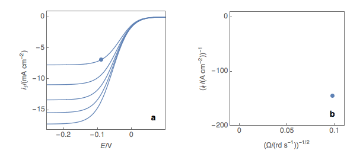
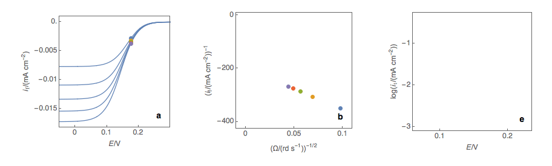
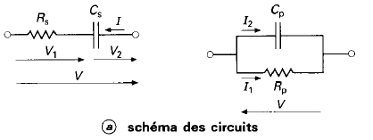
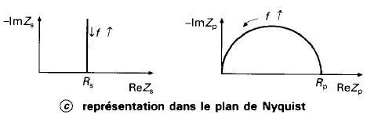
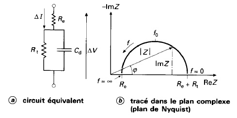
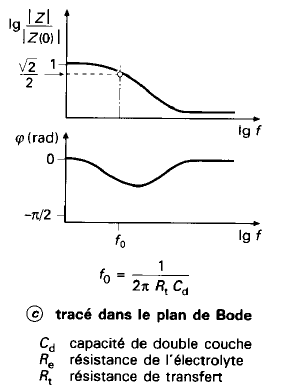
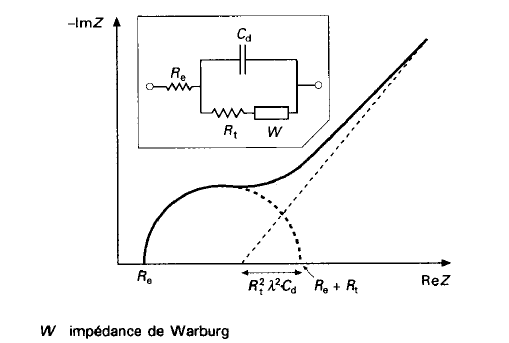

## Balancing Redox Half-Reactions

- Balancing the main element
- Balancing oxygen by adding water molecules $H_2O$
- Balancing hydrogen with Hydronium $H^+$

The **anode** $\rightarrow$ where **oxidation** happens
The **cathode** $\rightarrow$ where **reduction** happens

There is no link between electrode polarity and whether it's an anode or cathode.
Generator (battery or accumulator) $\rightarrow$ + is the cathode, Electrolysis $\rightarrow$ + is the anode

## Reference Electrodes

Because only potential *differences* are measured, reference electrodes are used.

The ideal *Standard Hydrogen Electrode (SHE)* has a 0V potential at all temperatures, it's defined by the couple $H^+ / H_2$ (STD: 1 bar pressure perfect gas and a $H^+$ concentration of $1\ \text{mol.L}^{-1}$).
This redox reaction occurs at a platinized [platinum](https://en.wikipedia.org/wiki/Platinum) electrode. The electrode is dipped in an acidic solution and pure hydrogen gas is bubbled through it. The concentration of both the reduced form and oxidized form is maintained at unity.

$$
2 H^+_{(aq)} + 2 e^− → H_{2(g)}
$$

The *Normal Hydrogen Electrode*[^2] is the closest real electrode to the SHE with identical pressure and concentration. Its potential is $6\text{mV}/$SHE, the concentration needs to be slightly higher to approximate SHE even further.

*Calomel Electrode:*

The calomel electrode is a type of half-cell in which the electrode is mercury coated with calomel ($\text{Hg}_2\text{Cl}_2$) and the electrolyte is a solution of potassium chloride and saturated calomel.

The electrode reaction is:

$$
\text{Hg}^{2+}_2 + 2e^- \leftrightharpoons 2\text{Hg(l)}, \qquad E^0_{\text{Hg}^{2+}_2 / \text{Hg}} = +0.80\text{V}
$$

$$
\text{Hg}_2\text{Cl}_2 + 2e^- \leftrightharpoons 2\text{Hg(l)} + 2 \text{Cl}^-, \qquad E^0_{\text{Hg}_2\text{Cl}_2 / \text{Hg(l)},\text{Cl}^-} = +0.27\text{V}
$$

$$
\text{Hg}^{2+}_2 + 2\text{Hg(l)} + 2 \text{Cl}^- \leftrightharpoons \text{Hg}_2\text{Cl}_2 + 2\text{Hg(l)}, \qquad E^0_{\text{Hg}_2\text{Cl}_2 / \text{Hg}^{2+}_2, \text{Cl}^-} = +0.53\text{V}
$$

## Nernst Equation

For this half equation:

$$
x \text{Ox} + n e^- \leftrightharpoons y \text{Red}
$$

$$
E = E_0 + \frac{RT}{nF}\ln\left(\frac{[\text{Ox}]}{[\text{Red}]}\right)
$$

- $E$: Reduction potential at temperature of interest / Fermi level
- $E^0$: Standard half-cell reduction potential
- $n$: Number of electrons exchanged

## Cyclic Voltammetry



The peak happens because the rising Fermi level of the electrode allows it to give (and falling $E_F$ allows it to take $e^-$) electrons from the solution.

Keep in mind the metal electrode's Fermi level will match the solution's Fermi level which is defined as $\frac{1}{2}$(HOMO + LUMO) almost instantaneously after putting the electrode in the solution.

The peak is not a plateau because the reaction is limited by mass transport — the reactants no longer have enough time to reach the electrode surface and the concentration decreases as they are consumed, leading to falling current values.

## Levich Treatment

Can be used to find the diffusion constant $D$ for a given species as a function of the rotation rate of the rotating disk electrode[^3]. Sigmoidal voltammograms are expected with a steady-state limiting current $I_L$:

$$
I_L = 0.201 n F A D^\frac{2}{3}\omega^\frac{1}{2}\nu^\frac{-1}{6} C
$$

- $n$: Number of moles of electrons
- $\omega$: Rotation rate in rpm (for $rad/s$)
- $D$: Diffusion coefficient $cm^2/s$
- $\nu$: Kinematic viscosity in $cm^2/s$
- $C$: Bulk analyte concentration in $mol/cm^3$

## Koutecky-Levich Treatment

The Koutecký-Levich analysis allows researchers to obtain kinetic parameters for a redox reaction such as the standard reaction constant[^4] *k*° and the symmetry factor α.

The *first step* is to plot at a fixed potential the values of the current at the various rotation rates (Fig. 1a). The value of the potential is chosen before the current plateau.
The *second step* is to plot the inverse of the current values as a function of the inverse of the square root of the rotation speed (Fig. 1b). This is what is called the Koutecký-Levich plot.

***Figure 1:** **(a)** I vs. E curves obtained on an irreversible system on a Rotating Disk Electrode at various rotation speeds. The dots represent the points chosen to plot the Koutecký-Levich lines shown in **(b)**. These lines are then extrapolated **(c)** to obtain the electronic transfer current $I_t$ **(d)**.*

The *third step* is to extrapolate the Koutecký-Levich line to 0, which corresponds to a theoretical infinite rotation speed (Fig. 1c, black dot). At this point, the current value corresponds to the electronic transfer current $I_t$ — the current that you would obtain if there was absolutely no limitation by mass transport.

***Figure 2: (a)** I vs. E curves obtained on an irreversible system on a Rotating Disk Electrode at various rotation speeds. The dots represent the points chosen to plot the Koutecký-Levich lines shown in **(b)**. These lines are then extrapolated **(c)** to obtain the electronic transfer current $I_t$ **(d)**. This is carried out at various potentials to obtain the Tafel curve shown in **(e)**.*

Performing these three steps at several potential values (Fig. 2a, b, c, d) allows you to plot the Tafel curve (Fig. 2e). The slope of this curve gives the value of the symmetry factor $\alpha_r$ while the current value at $E = E°$ gives the value of the standard kinetic constant $k°$, given the concentration of the reactive species and the number of electrons involved in the redox reaction.

## Impedance Spectroscopy

*Some resources:*









In a Lissajous curve, a distorted ellipse means there is too much of a perturbation on the system — the AC part of the signal is too big and becomes non-linear.

Sometimes the chosen AC amplitude is good for some frequency ranges but not for others, meaning you have to make different measurements with different AC amplitudes.

Electrochemical systems are modeled using equivalent circuits (with basic R, L, C components or others like CPE: Constant Phase Element).

### Some Basic Bode/Nyquist Plots

{.inverted fig-align="center"}

{.inverted fig-align="center"}

{.inverted fig-align="center"}

The peak of a semi-circle (parallel RC) corresponds to the time constant of the system $\omega = \frac{1}{\tau} = \frac{1}{RC}$

{.inverted fig-align="center"}

### Randles Circuit

{.inverted fig-align="center"}

- $R_e$: Models the bulk electrolyte resistance
- $R_t$: Charge transfer resistance at the electrode-electrolyte interface
- $C_d$: Double-layer capacitance (charge build-up at the interface)
- $W$: Models slow diffusion processes (Warburg impedance)





## Electrode Kinetics

### Butler-Volmer

$$
j = j_0 \left\{e^{\left(\frac{\alpha_a z F}{RT}(E-E_{eq})\right)} - e^{\left(-\frac{\alpha_c z F}{RT}(E-E_{eq})\right)}\right\}
$$

$$
j = j_0 \left\{e^{\left(\frac{\alpha_a z F}{RT}\eta\right)} - e^{\left(-\frac{\alpha_c z F}{RT}\eta\right)}\right\}
$$

- $E$: Electrode potential
- $E_{eq}$: Equilibrium potential
- $z$: Number of electrons involved in the electrode reaction

### Tafel

$$
\eta = A \log\left(\frac{j}{j_0}\right)
$$

- $\eta$: Overpotential
- $A$: Tafel slope
- $j$: Current density $(A/m^2)$
- $j_0$: [Exchange current density](https://en.wikipedia.org/wiki/Exchange_current_density)

The Tafel equation is an approximation of the Butler-Volmer equation at high overpotentials $(\lvert\eta\rvert > 0.1 V)$. It assumes that the concentrations at the electrode are practically equal to the concentrations in the bulk electrolyte, allowing the current to be expressed as a function of potential only. In other words, it assumes that the electrode mass transfer rate is much greater than the reaction rate, and that the reaction is dominated by the slower chemical reaction rate. Also, at a given electrode the Tafel equation assumes that the reverse half reaction rate is negligible compared to the forward reaction rate.

#### Supporting Electrolyte

When performing electroanalytical experiments, it is conventional to add a large quantity of inert salt to the solution — this artificially added salt is called supporting electrolyte.
The purpose of the supporting electrolyte is to increase the conductivity of the solution, and hence to eliminate the electric field from the electrolyte.

A negligible electric field provides two advantages for electroanalysis:

- The voltage due to the resistance of the electrolyte when the cell draws current ("ohmic drop") is minimal. Therefore, the potential difference applied across the electrochemical cell is localized at the electrode–electrolyte interfaces, and so the activation overpotential perceived by the redox couple at this interface is almost exactly proportional to the applied cell voltage. The kinetic behavior of the electrochemical cell then has no explicit dependence on the magnitude of the drawn current.
- The contribution of migration to the transport of charged chemical species is negligible compared to the contribution of diffusion (and of convection, in a forced flow). Therefore the transport properties of the system are linearized, and they do not depend on the magnitude of the drawn current.

Even for the conductivities of electrolyte solutions in the presence of excess supporting electrolyte, the electric field is not negligible if significant current density is drawn. Electroanalysis typically draws small currents because the purpose is measurement. In processes where an electrochemical reaction is driven — such as electrolysis, electrodeposition, batteries, and fuel cells — current densities are typically much larger, so that the desired extent of reaction is achieved in a reasonable time. Under these conditions, significant electric fields are likely and other charge conservation models should be used instead.

#### Scan Rate Influence

The scan rate of the experiment controls how fast the applied potential is scanned. Faster scan rates lead to a decrease in the size of the diffusion layer; as a consequence, higher currents are observed.[^scanrate] For electrochemically reversible electron transfer processes involving freely diffusing redox species, the Randles–Ševčík equation describes how the peak current $i_p$ (A) increases linearly with the square root of the scan rate $\upsilon$ (V s$^{-1}$), where $n$ is the number of electrons transferred, $A$ (cm$^2$) is the electrode surface area, $D_0$ (cm$^2$ s$^{-1}$) is the diffusion coefficient of the oxidized analyte, and $C^0$ (mol cm$^{-3}$) is the bulk concentration of the analyte.

$$
i_p = 0.446\, nFAC^0 \left(\frac{nF\nu D_0}{RT}\right)^{\frac{1}{2}}
$$

[^2]: Debatable — "normal" is the old name for "standard" in France.
[^3]: Bard, Allen J.; Larry R. Faulkner (2000). *Electrochemical Methods: Fundamentals and Applications* (2nd ed.). Wiley. p. 336.
[^4]: In theory, the Koutecký-Levich analysis only works for redox reactions with a standard kinetic constant $k°$ smaller or equal to several $10^2$ cm s$^{-1}$, that is to say, for sluggish reactions. In practice, most reactions are neither sluggish nor rapid.
[^scanrate]: For a review see: Elgrishi, N. et al. *J. Chem. Educ.* 2018, 95, 197–206.
