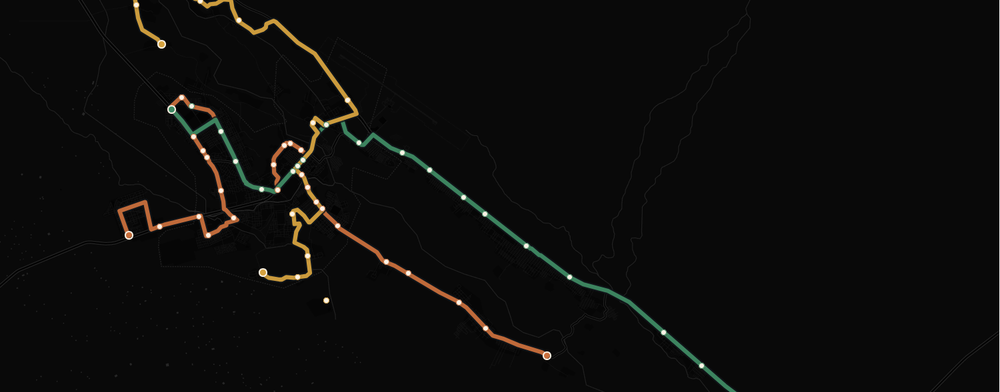
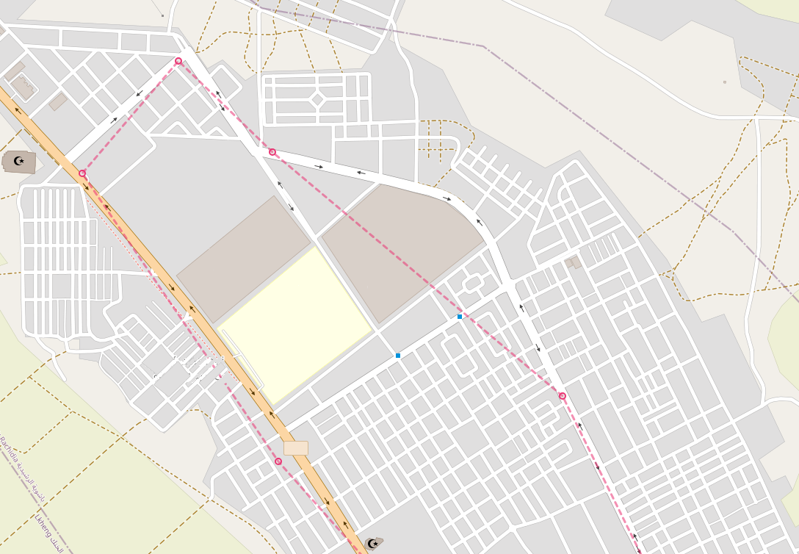
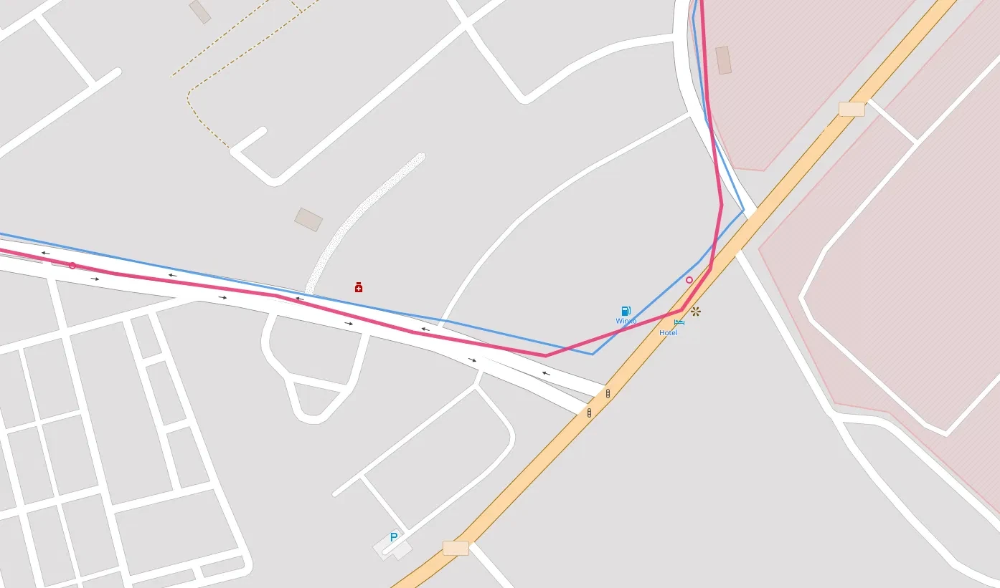
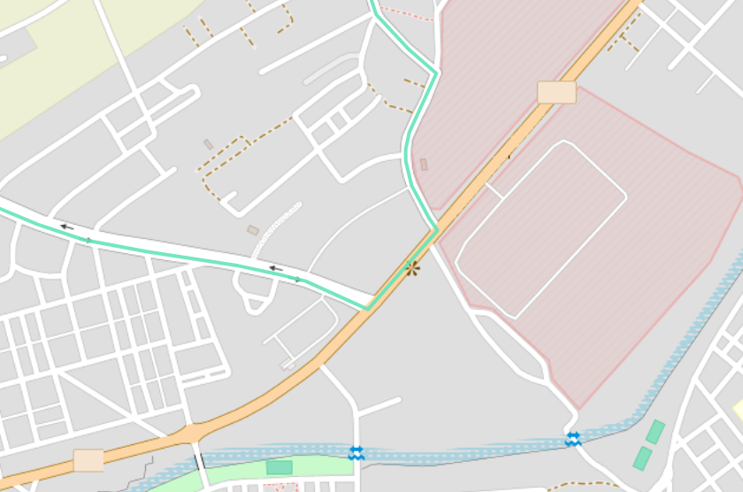
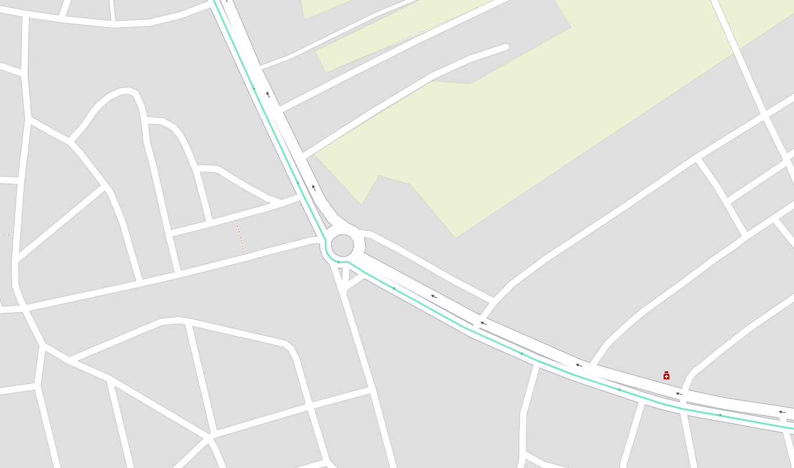

::: {.column-screen}
{style="width:100%;display:block;max-height:420px;object-fit:cover;"}
:::

## Introduction
I was surprised to learn that my hometown had an android app that tracks the city's buses in real time. It is very useful since the bus frequency is very low and unreliable, so knowing the real-time location of the buses is crucial in order to plan your trips. When I tried out the app, it was functional, but very basic, the interface was clunky, the design was not great, and the ETA predictions made no sense.

I wondered if it was possible to build something better, and maybe a good learning experience since I was curious about how the app worked. I decided to reverse engineer it and build my own bus tracker. Maybe even later down the line, we could build a model to predict the arrival times of the buses at each stop using historical data, which would be more accurate than the app's predictions.

## Reverse Engineering the App
The first step was to reverse engineer the app to understand how it worked and how it communicated with its server. This is a small town, so I expected the communications to be pretty basic. First thing I tried was to see what kind of requests the app was making to fetch the live bus data. I already have the app on my phone, so I set up a proxy server on my computer using mitmproxy, configured my phone to route its traffic through the proxy, and installed the mitmproxy certificate in order to intercept HTTPS traffic. Thankfully we will not be decompiling any APKs or binaries today, nor will we need to fire up wireshark or any kind of disassembler, as I would be way out of my depth for that kind of challenge. I simply opened the app and watched the traffic. Lo and behold, the request wasn't even using HTTPS, installing the certificate wasn't even necessary. The app was making simple periodic POST requests to a single endpoint with the same payload, and the response contained over 100 KB of data.

### Anatomy of the response

A single `POST` to `/api/line_horaires/48` with the body `{"reseaux_id": 8}` returns *everything* the app needs to draw the map. There's no second call for stops, no separate endpoint for live positions, it all comes back in one ~100 KB JSON object with five top-level keys:

```json
{
  "line":            { /* line + network metadata */ },
  "stations_aller":  [ /* 32 stops, outbound order */ ],
  "stations_retour": [ /* the same 32 stops, reversed */ ],
  "buses_aller":     [ /* live buses heading outbound */ ],
  "buses_retour":    [ /* live buses heading back */ ]
}
```

`aller` and `retour` are French for the outbound and return legs, this line runs one physical route in two directions, and the API mirrors that split everywhere.

#### `line`, what this route *is*

The metadata block. The useful fields are `line_name` (`"L02"`), `line_color` (`"#e81e63"`, the route's own pink, which I will not reuse for mny own map), and the two human-readable direction labels, `aller_direction` (`"Ahibous(31)"`) and `retour_direction` (`"Omrane (1)"`).

Nested inside is a `reseaux` ("network") object describing the city itself: Errachidia, network `id` 8, that `8` is exactly what the request body sends as `reseaux_id`. It even carries the network's own backend `host`, a different IP from the one the app talks to, which is presumably where the raw GPS data originates before this server aggregates it.

#### `stations_aller` / `stations_retour`, the stops

Two ordered lists of the same 32 stops. (They're numbered Omrane **(1)** through Ahibous **(31)**, but there are 32 because of a half-numbered insert, "Bachaouia (17/2)", wedged between Ocean (17) and Grande Salle (18).) Each entry carries what you'd expect:

- `station_name`, `station_lat`, `station_lng`, the label and position
- `step`, the stop's order along the route, `0` to `31`
- `sens`, direction flag: `1` outbound, `0` return
- `direction`, the terminus this direction heads toward

`stations_retour` is just `stations_aller` reversed: Omrane's `step 0` outbound becomes its `step 30` on the way back. So for drawing purposes, one list of coordinates sorted by `step` gives you both the stop markers and a first-draft route line.

A quirk worth noting: every station object also contains nested `lines` and `line_stations` arrays that re-describe *the same stop again*, mostly as a duplicate of itself viewed from the opposite direction. It's redundant denormalization, the kind of thing an ORM emits when you serialize a record with all its relations eagerly loaded. For rendering, I ignore it entirely.

#### `buses_aller` / `buses_retour`, the live part

This is the data that actually moves, and the two arrays are mutually exclusive in practice: whichever way the bus is currently travelling, that array holds it and the other is empty. In this snapshot the bus is on its return leg, so `buses_aller` is `[]` and `buses_retour` has one entry. Each bus object gives:

- `bus`: the vehicle ID (`"12203"`)
- `sens`: its current direction
- `localisation`: current position as a `"lat,lng"` **string**
- `updated_at`: when the GPS last reported
- `param`: a much larger field, described below

(Across both of my captures only a single vehicle, 12203, ever appeared — one bus shuttling back and forth; usually there are two, but it's the Eid holidays this week, though the array shape clearly allows several at once.)

#### `param`: the whole trip plan, stringified

The richest field is `param`, and it's a piece of JSON that's been **serialized into a string** and stuffed inside the outer JSON, so you have to parse it a second time to read it. Accented French names show up as unicode escapes inside it (`Universit\u00e9`, `March\u00e9`), which decode normally.

Once parsed, it's essentially the bus's entire journey: the full ordered `lineStations`, the two termini (`lineStart` and `lineDirection`), a `stops` array giving a predicted `arrivalTime` and segment `duration` for every upcoming stop, a `totalDuration` for the whole run, and `arrivalTimeAtLastStop`. It's the single most information-dense part of the payload.

#### `horaires`: predicted arrivals, attached per-stop

When a bus is active in a given direction, each upcoming stop in *that* direction's station list also gets a small `horaires` array: the bus's current `localisation`, an `arrivalTime`/`duration` in minutes, and a human `arrivalHour`. In this return-leg snapshot these appear on the `stations_retour` entries; on the outbound capture they were on `stations_aller`. Note the encoding flips here too, inside `horaires`, `localisation` is an **array** `["lat", "lng"]` rather than the comma-joined string the bus object uses. Same data, two formats, in one response.

#### Two quirks worth noting

Comparing the two captures surfaced a couple of findings that aren't obvious from a single response:

**The direction toggle in the app is cosmetic.** The request never changes, same endpoint, same `{"reseaux_id": 8}` body, and the server *always* returns both station lists. Only the live bus and its `horaires` populate whichever direction is currently being served. So flipping the app's direction tab just re-renders data the client already has; it isn't fetching anything new. Watching the bus migrate from `buses_aller` to `buses_retour` between captures confirmed it.

**There's a timezone trap.** `updated_at` is in UTC with no timezone suffix (`2026-05-30 16:13:06`), but every `arrivalHour` is Morocco local time, UTC+1. They sit side by side in the same payload looking like the same clock. The cross-check: at 16:13 UTC (17:13 local) the bus had just reached Ahibous, and the next stop Asrir shows `arrivalTime: 2` with `arrivalHour: "17:15"`, two minutes later in local time. Miss that one-hour offset and every "last updated" label on the map reads an hour stale.

That's pretty much the whole API for this single line. As you can see, the "reverse engineering" here is very basic and straightforward. I was initially worried that I might have to do some APK decompilation or more complex network analysis, but luckily the process was transparent enough to be done within a couple of minutes. On to building something better with this data.

## Rebuilding the Polyline
Currently, the app uses straight lines between the stops, which neither shows the actual path the bus takes nor looks good.


 One way to solve this problem is to collect enough GPS datapoints from a bus traversing the route in both directions, then feed those points to OSRM (_Open Source Routing Machine_) to get a cleaner, road-snapped path. I used the following script to collect the datapoints and progressively build a `.jsonl` file we can use with OSRM:
```python
import argparse
import json
import sys
import time
from datetime import datetime, timezone
from pathlib import Path

import requests

API_URL = "http://xxx.xxx.xx.xx/api/line_horaires/48"
PAYLOAD = {"reseaux_id": 8}
OUT_DIR = Path(__file__).parent
LATEST = OUT_DIR / "latest.json"
HISTORY = OUT_DIR / "history.jsonl"
TIMEOUT = 10


def parse_buses(data):
    """Flatten buses_aller + buses_retour into simple position dicts."""
    buses = []
    for direction_key in ("buses_aller", "buses_retour"):
        for b in data.get(direction_key, []):
            loc = b.get("localisation", "")
            try:
                lat_str, lng_str = loc.split(",")
                lat, lng = float(lat_str), float(lng_str)
            except (ValueError, AttributeError):
                # malformed/empty localisation -> skip this bus this tick
                continue
            buses.append({
                "bus": b.get("bus"),
                "sens": b.get("sens"),
                "lat": lat,
                "lng": lng,
                # the API's own GPS timestamp (note: appears to be UTC)
                "src_updated_at": b.get("updated_at"),
            })
    return buses


def poll_once():
    """Fetch, parse, write latest.json, append to history.jsonl. Returns bus count."""
    # client-side timestamp, when WE fetched it
    fetched_at = datetime.now(timezone.utc).isoformat()

    resp = requests.post(API_URL, json=PAYLOAD, timeout=TIMEOUT)
    resp.raise_for_status()
    data = resp.json()

    buses = parse_buses(data)
    snapshot = {"fetched_at": fetched_at, "buses": buses}

    # latest.json: overwrite (write to temp then replace, so the map never
    # reads a half-written file)
    tmp = LATEST.with_suffix(".json.tmp")
    tmp.write_text(json.dumps(snapshot, ensure_ascii=False, indent=2))
    tmp.replace(LATEST)

    # history.jsonl: append one compact line
    with HISTORY.open("a", encoding="utf-8") as f:
        f.write(json.dumps(snapshot, ensure_ascii=False) + "\n")

    return len(buses)


def main():
    ap = argparse.ArgumentParser()
    ap.add_argument("--once", action="store_true", help="poll a single time and exit")
    ap.add_argument("--interval", type=int, default=15, help="seconds between polls")
    args = ap.parse_args()

    if args.once:
        try:
            n = poll_once()
            print(f"ok: {n} bus(es) logged")
        except Exception as e:
            print(f"error: {e}", file=sys.stderr)
            sys.exit(1)
        return

    print(f"polling every {args.interval}s -> {LATEST.name} + {HISTORY.name} ")
    while True:
        try:
            n = poll_once()
            stamp = datetime.now().strftime("%H:%M:%S")
            print(f"[{stamp}] {n} bus(es)")
        except requests.RequestException as e:
            # network hiccup: log it and keep going, don't crash the loop
            print(f"[{datetime.now():%H:%M:%S}] request failed: {e}",
                  file=sys.stderr)
        except Exception as e:
            print(f"[{datetime.now():%H:%M:%S}] unexpected: {e}", file=sys.stderr)
        time.sleep(args.interval)


if __name__ == "__main__":
    main()
```

The script is straightforward. It polls the API, parses the bus positions, and writes two files: `latest.json` which is the most recent snapshot of the bus positions, and `history.jsonl` which is a line-delimited JSON file that accumulates every snapshot over time. The `latest.json` file is what the map will read to show the current bus positions, while `history.jsonl` is what we will use to extract the GPS traces for building the polyline with OSRM. The script can be run in a loop with a specified interval, or just once for testing.

Once we have enough datapoints, we can use a preprocessed version of the `history.jsonl` file to feed into OSRM and get our improved route line. I wanted to try a simpler approach first, which is to just gather a dense set of GPS points and use them as the polyline. This is not ideal, since the points are noisy and sparse, and it was an improvement over the straight lines station-to-station from the official app:



As you can see, the main issue is that the polyline does a lot of corner-cutting due to the low resolution of the GPS points. I do not want to overload the server that is providing the bus data, so I am only polling every 10 seconds, which is in line with their own app's frequency. The reason I didn't feel the need to try higher frequency polling is that 1. I do not want to risk overloading their server, 2. I'm not sure the bus's GPS updates are actually more frequent than that, so it might not even help, and 3. I can use OSRM map-matching to fill in the gaps and get a smoother line without needing more points.

## OSRM and Road Matching
OSRM (Open Source Routing Machine) is a powerful tool for routing and map-matching. It can take a sequence of GPS points and match them to the most likely path on the road network, which is exactly what we need to clean up our bus route. By feeding our collected GPS points into OSRM's map-matching API, we can get a much more accurate and visually appealing polyline that follows the actual roads the bus takes, rather than cutting corners between stops.

A couple of hours of polling has collected a couple of thousand locations, and since I do not want to bother with preprocessing and clean up of duplicate points when the bus is stationary or points that are too close to each other, I decided to use a local OSRM instance and just feed it the entire history.
I retrieved Morocco's OSM data from [Geofabrik in PBF format](https://download.geofabrik.de/africa/morocco-latest.osm.pbf), which is an XML-like binary format well-suited for storage and editing, but not for running routing algorithms directly (Dijkstra, A*, etc.). So we extract the data, build the road graph, and then run the map-matching step. I used a Docker instance to run the OSRM pipeline locally:

```bash
# 1. Extract the data and build the graph using the car profile to get the right routing for a bus
docker run -t -v "${PWD}/data:/data" osrm/osrm-backend osrm-extract -p /opt/car.lua /data/morocco-260529.osm.pbf

# 2. Cut the graph into nested cells (like a hierarchy of regions)
docker run -t -v "${PWD}/data:/data" osrm/osrm-backend osrm-partition /data/morocco-260529.osrm

# 3. Compute actual travel-time weights for each cell boundary. Separate topology (partition) from weights (customize).
docker run -t -v "${PWD}/data:/data" osrm/osrm-backend osrm-customize /data/morocco-260529.osrm

# 4. Run the OSRM server to serve map-matching requests, allow 1000 points per request since we have a long history of GPS points to match.
docker run -t -i -p 5000:5000 -v "${PWD}/data:/data" osrm/osrm-backend osrm-routed --algorithm mld --max-matching-size 1000 /data/morocco-260529.osrm
```

This will create a bunch of output files (.osrm, .osrm.ebg, etc.) which will be written directly into a `data/` folder alongside the original `.pbf`. Once the server is running, we use the following script to feed it the GPS points and get the matched route:
```python
import json, time, math
from datetime import datetime
import requests

OSRM = "http://localhost:5000/match/v1/driving/"
MIN_MOVE_M = 5      # drop points closer than this to the previous one
MAX_POINTS = 4000    # OSRM public limit per request
RADIUS_M = 25       # GPS accuracy hint

def haversine(a, b):
    R = 6371000
    p1, p2 = math.radians(a[0]), math.radians(b[0])
    dphi = math.radians(b[0]-a[0]); dl = math.radians(b[1]-a[1])
    h = math.sin(dphi/2)**2 + math.cos(p1)*math.cos(p2)*math.sin(dl/2)**2
    return 2*R*math.asin(math.sqrt(h))

# 1. load
rows = []
with open("history.jsonl") as f:
    for line in f:
        line = line.strip()
        if not line: continue
        o = json.loads(line)
        for b in o["buses"]:
            rows.append({"ts": o["fetched_at"], "sens": b["sens"],
                         "lat": b["lat"], "lng": b["lng"]})

# 2. segment into runs by sens
segs, cur, cursens = [], [], None
for r in rows:
    if r["sens"] != cursens:
        if cur: segs.append((cursens, cur))
        cur, cursens = [], r["sens"]
    cur.append(r)
if cur: segs.append((cursens, cur))

print("Runs found:")
for i,(s,c) in enumerate(segs):
    print(f"  [{i}] sens={s}  n={len(c)}  {c[0]['ts'][11:19]}–{c[-1]['ts'][11:19]}")

def clean(run):
    out = []
    for r in run:
        p = (r["lat"], r["lng"])
        if not out or haversine((out[-1]["lat"], out[-1]["lng"]), p) >= MIN_MOVE_M:
            out.append(r)
    # thin to MAX_POINTS evenly if still too long
    if len(out) > MAX_POINTS:
        step = len(out)/MAX_POINTS
        out = [out[int(i*step)] for i in range(MAX_POINTS)]
    return out

def match(run):
    run = clean(run)
    coords = ";".join(f"{r['lng']},{r['lat']}" for r in run)  # OSRM is lng,lat
    radii  = ";".join(str(RADIUS_M) for _ in run)
    ts     = ";".join(str(int(datetime.fromisoformat(r["ts"]).timestamp())) for r in run)
    params = {"geometries": "geojson", "overview": "full",
              "radiuses": radii, "timestamps": ts}
    resp = requests.get(OSRM + coords, params=params, timeout=30)
    resp.raise_for_status()
    data = resp.json()
    if data.get("code") != "Ok":
        raise RuntimeError(f"OSRM: {data.get('code')} {data.get('message','')}")
    # stitch geometry from all matched segments
    feats = [m["geometry"]["coordinates"] for m in data["matchings"]]
    coords_out = [pt for seg in feats for pt in seg]
    conf = [round(m.get("confidence",0),3) for m in data["matchings"]]
    print(f"  matched: {len(coords_out)} pts, confidence={conf}")
    return {"type":"Feature","geometry":{"type":"LineString","coordinates":coords_out},
            "properties":{"confidence":conf}}

# 3. pick one clean run per direction and match.
#    EDIT these indices after reading the "Runs found" printout.
ALLER_IDX  = 1   # a sens=1 run
RETOUR_IDX = 0   # a sens=0 run

for name, idx in [("route_aller", ALLER_IDX), ("route_retour", RETOUR_IDX)]:
    sens, run = segs[idx]
    print(f"\n{name}  (seg {idx}, sens={sens}):")
    gj = match(run)
    with open(f"{name}.geojson","w") as f:
        json.dump(gj, f)
    print(f"  wrote {name}.geojson")
    time.sleep(1)   # be polite to the server if using public OSRM instance
```

Let's break down the script. We define the haversine function, which is simply a way to calculate the distance between two coordinates on a sphere. It calculates the great-circle distance between two points on the Earth's surface, which is why it uses earth's radius of 6371 km as a hardcoded value. You could use something like $\sqrt{\Delta lat^2 + \Delta lng^2}$ for a rough approximation, but it gets inaccurate over larger distances or near the poles, so haversine is a more robust choice for a couple of extra lines of code. We start by loading the jsonl file and parsing the bus positions into a list of rows. We then segment the data into runs based on the `sens` value, which indicates the direction of the bus. Each run is a sequence of GPS points for a single direction. We print out the runs we found, along with their timestamps, so we can choose which ones to use for matching. The `clean` function filters out points that are too close to each other, and also thins the points if there are more than `MAX_POINTS`. The `match` function takes a run of GPS points, formats them for the OSRM API, and sends a request to get the matched route. It then stitches together the matched segments into a single GeoJSON LineString feature. Finally, we pick one run for each direction (based on the printed output), match it, and write the resulting GeoJSON to a file.

Now we have two GeoJSON files, `route_aller.geojson` and `route_retour.geojson`, which contain the matched routes for the outbound and return legs of the bus line. We can use these files to draw the routes on our map:


The routes are much smoother now, following the actual roads instead of cutting corners between stops.



The confidence values from OSRM can also be used to indicate how well the GPS points matched the road network, which can be useful for debugging or further refining the data collection process. These polylines can now be used in our custom bus tracker map to show the actual paths the buses take, which looks much better and is more informative.


## Deploying a Worker to Serve the Map
Right now, I'm polling the API from my machine and writing the latest bus positions to a local file. If we want to run this continuously and reliably enough to serve a live map, we should deploy the polling script to a server or cloud function that can run uninterrupted. This way the `latest.json` file stays current and we can serve it to the frontend without worrying about downtime or connectivity issues. Since scaling isn't a concern, a simple Cloudflare Worker is sufficient.

The worker's job is to be a request handler: every time the map frontend calls the worker URL, Cloudflare invokes the `fetch` function of the default export. The skeleton looks like this:
```javascript
export default {
  async fetch(request) {
    // ...
  }
};
```

`async` allows the function to use `await` for asynchronous operations. Next, we handle CORS. Our frontend is served from a different origin than the worker, so we need the appropriate CORS headers. The browser sends an `OPTIONS` preflight request to check if the server allows cross-origin requests:
```javascript
if (request.method === "OPTIONS") {
  return new Response(null, {
    headers: {
      "Access-Control-Allow-Origin": "*",
      "Access-Control-Allow-Methods": "GET",
    }
  });
}
```
`Access-Control-Allow-Origin: *` means "any website is allowed to call me", a wildcard is fine since the bus data is public. `Access-Control-Allow-Methods: GET` marks `GET` requests as permitted. The response body is `null` because preflights don't need content, just headers.

Now we fetch the actual bus API:
```javascript
const resp = await fetch("http://HOSTNAME/api/line_horaires/48", {
  method: "POST",
  headers: { "Content-Type": "application/json" },
  body: JSON.stringify({ reseaux_id: 8 }),  // Number 8 identifies the city/network which we found out during our reverse engineering step
});
```

Notice the `HOSTNAME` instead of the raw IP address I used in the polling script. Cloudflare Workers don't allow outgoing requests to bare IP addresses for security reasons. A quick `nslookup` on the IP revealed the associated hostname, so I used that instead.

Finally, we parse the response with:
```javascript
const data = await resp.json();
```

But this is the full ~100 KB object we saw earlier. We only need the fields useful to us:

```javascript
const buses = [];
for (const key of ["buses_aller", "buses_retour"]) {
  for (const b of (data[key] || [])) {
    const [lat, lng] = (b.localisation || "").split(",").map(Number);
    if (!isNaN(lat) && !isNaN(lng)) {
      buses.push({
        bus: b.bus,
        sens: b.sens,
        lat, lng,
        src_updated_at: b.updated_at,
      });
    }
  }
}
```

Walking through the snippet:

- `for (const key of ["buses_aller", "buses_retour"])`: iterates over both direction arrays in one loop rather than duplicating the code.
- `(data[key] || [])`: if a direction has no buses (empty or missing array), `|| []` yields an empty iterable instead of crashing.
- `b.localisation.split(",").map(Number)`: the API gives position as the string `"31.883,-4.355"`. Split on the comma to get `["31.883", "-4.355"]`, then `map(Number)` converts each to a float. The destructuring `const [lat, lng] =` unpacks them in one line.
- `if (!isNaN(lat) && !isNaN(lng))`: guards against a missing or malformed `localisation`. `Number("") === NaN`, so this safely skips bad rows rather than pushing garbage coordinates.
- `{ bus, sens, lat, lng, src_updated_at }`: just the five fields the map needs. `lat, lng` is shorthand for `lat: lat, lng: lng` in modern JavaScript, which I only know about thanks to one of those LLM chatbots, I haven't read the JS documentation in over 10 years at this point.

Now we have a clean `buses` array with the current positions and metadata for all active buses. We can return this as JSON to the frontend using a response like this:
```javascript
return new Response(
  JSON.stringify({ fetched_at: new Date().toISOString(), buses }),
  {
    headers: {
      "Content-Type": "application/json",
      "Access-Control-Allow-Origin": "*",
      "Cache-Control": "no-store",
    }
  }
);
```

The only thing really new here is `"Cache-Control": "no-store"`, which tells browsers and intermediate caches not to store this response at all, ensuring that every request to the worker gets fresh data from the bus API. 

Once deployed, we point our frontend map at the worker URL instead of the original API. It serves live bus positions with the same data structure we had in `latest.json`, but now it's always up to date and doesn't depend on a local machine running the polling script.

## The Live Map

The pipeline comes together here. GPS positions arrive from the bus API every 10-15 seconds, a Cloudflare Worker strips the 100 KB payload down to the handful of fields the map actually needs, and Leaflet renders them against road-matched routes built from the historical GPS trace.

The city runs three lines: L02, examined in detail above, runs between Omrane and Ahibous; L01 connects Amazouj to Meski; L03 covers the route between My Mhamed and Tizegdalt. The same API structure, polling pipeline, and OSRM map-matching process applies to all three.

```{=html}
<iframe src="map.html?lines=l01,l02,l03"
        style="width:100%;height:560px;border:none;border-radius:6px;display:block;"
        loading="lazy"
        title="Errachidia live bus map - L01, L02, L03">
</iframe>
```

Clicking a bus marker highlights its line; the section of route already traveled is shown at reduced opacity to indicate which way it is heading.

Is it better than the original app? On the things that matter for a bus tracker, knowing where the bus actually is and what route it takes, probably yes. The routes here follow real streets, the data is refreshed at the same rate the app uses, and all three lines are visible at once. I'm no design expert, but I think this is also a better looking map and a better user experience. Of course we can do further improvements, like selecting a destination and have the map route you through the network to get there, or as mentioned at the top, building a model to predict the arrival times of the buses at each stop using historical data. This would be more accurate than the app's predictions, but would mean more work when I aleady have a list of other on-hold projects I should be picking back up. But I'm satisfied with this as an initial milestone.

The step I found most unexpectedly interesting was the map-matching. Taking a scattered cloud of GPS pings sampled every 15 seconds from a moving bus, feeding them to OSRM's Hidden Markov Model matcher, and getting back a clean polyline that follows actual roads.

The historical data is still accumulating. I mentioned arrival-time prediction at the top, and that is still on the table. Weeks of 15-second GPS snapshots across all three lines is a reasonable foundation for a model that does better than the app's current estimations, which by the way, is not clear how those are calculated. Something that learns the actual shape of the schedule, the morning delays, the time it takes to clear the roundabout near the market etc. That is for another post.