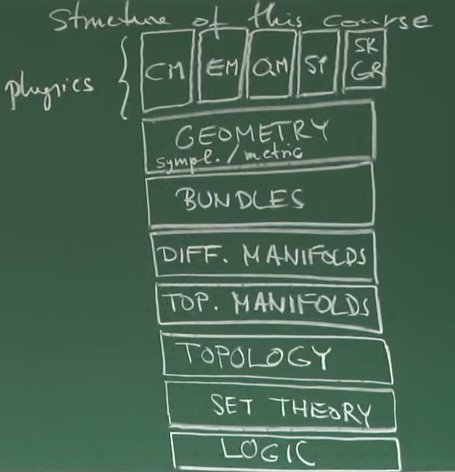
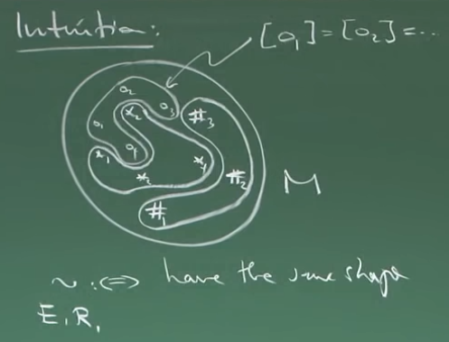

Notes from [this lecture series](https://www.youtube.com/playlist?list=PLPH7f_7ZlzxTi6kS4vCmv4ZKm9u8g5yic) by Frederic Schuller, building the mathematical background for Classical Mechanics, Statistical Mechanics, SR, GR, EM & QM.



## Introduction — Logic of Propositions and Predicates

### Structure of the Course

{fig-align="center"}

### I.I: Propositional Logic

## Chapter I: Axiomatic Set Theory

A *proposition* is a variable that can be true or false. No others. We can create new propositions from given ones using *logical operators.*

### a) Unary Operators

| P | Not P | Identity | Tautology | Contradiction |
| --- | --- | --- | --- | --- |
| T | F | T | T | F |
| F | T | F | T | F |

### I.IV The $\epsilon$-relation

Set Theory is built on the postulate that there is a fundamental relation[^1] called $\epsilon$. There will not be a definition in the strict sense of what $\epsilon$ or what a set is. Instead, there will be 9 axioms that speak of $\epsilon$ and of sets.

#### Overview of Axioms

Using the $\epsilon$-relation we can immediately define:

$$x \notin y \iff \neg(x \in y)$$

$$x\subseteq y \iff \forall a: (a \in x \implies a \in y)$$

$$x = y \iff (x \subseteq y)\ \land\ (y \subseteq x)$$

{fig-align="center"}

### I.V Zermelo-Fraenkel Axioms of Set Theory

#### Axiom on the $\epsilon$-relation (E)

$x \in y$ is a proposition (either true or false) if and only if $x$ and $y$ are **both** sets.

*Counterexample (Russell's Paradox and naive Set Theory):*

Assume there is a set $u$ of all sets that do not contain themselves:

$$\exists u: \forall z: (z \in u \iff z \notin z)$$

Is $u$ a set? If so, one must decide whether $u \in u$ is true or false[^2].

**Assume $u \in u$ is true:** then by definition $u \notin u$, which is contradictory.

**Assume $u \in u$ is false:** $\iff u \in u$, also a contradiction.

We must conclude therefore that $u$ ***is not a set.***

$x \in y$ is either true or false, formally:

$$\forall x: \forall y: (x \in y) \veebar(x\notin y)$$

#### Axiom on the Existence of the Empty Set (E)

There exists a set that contains no elements:

$$\exists x: \forall y:\ y\notin x$$

**Theorem.** There is only one empty set, we therefore call it $\varnothing$.

**Proof (textbook).** Assume $x$ and $x'$ are both empty sets:

$$\forall y: y \in x \implies y \in x'$$

$$x \subset x'$$[^3]

Conversely:

$$\forall y: y \in x' \implies y \in x$$

$$x' \subset x$$

$$x = x' \implies \text{the empty sets must be the same}$$

**Proof (formal).**

$$a_1 \Leftrightarrow \forall y: y\notin x$$

$$a_2 \Leftrightarrow \forall y: y\notin x'$$

$$q_1 \Leftrightarrow \forall y: y\notin x \implies \forall y: (y \in x \implies y \in x')$$

$$q_2 \Leftrightarrow \forall y: y\notin x$$

$$q_3 \Leftrightarrow q_1 \land q_2 \Leftrightarrow \forall y: (y \in x \implies y \in x')$$

Similar steps to get $x' \in x \implies x = x'$.

#### Axiom on Pair Sets (P)

Let $x$ and $y$ be sets. There exists a set that contains as its elements precisely $x$ and $y$:

$$\forall x: \forall y: \exists m: \forall u: (u \in m \Leftrightarrow u = x \lor u = y)$$

**Notation.** Denote this set $m$ by $\{x,y\}$.[^4]

**Definition.** $\{x\} \coloneqq \{x, x\}$

#### Axiom on Union Sets (U)

Let $x$ be a set, there exists a set $u$ whose elements are precisely the elements of the elements of $x$.

**Notation.** $u = \cup\ x$

**Example.** Let $a, b$ be sets. Using the pair sets axiom:
$\implies \{a\}$ is a set, $\{b\}$ is a set $\implies x = \{\{a\}, \{b\}\}$ is a set, $\cup x = \{a, b\}$

**Example.** $a,b,c$ are sets:
$x = \{\{a\}, \{b,c\}\}$ is a set $\implies \cup x \coloneqq \{a,b,c\}$ is a set

**Definition.** Let $a_1, a_2, .., a_N$ be sets, recursively for all $N \geq 3$:

$$\{a_1,.., a_{N}\} \coloneqq \bigcup \{\{a_1, .., a_{N-1}\}, \{a_N\}\}$$

#### Axiom of Replacement (R)

Let $R$ be a functional relation and $m$ be a set. The image of $m$ under $R$ is again a set.

**Definition.** A relation $R$ is called functional if $\forall x: \exists! y: R(x,y)$.

The image of a set $m$ under a functional relation $R$ consists of all $y$ for which there is $x \in m$ such that $R(x,y)$.

**Theorem.** Let $P$ be a predicate of one variable and $m$ a set. The elements $y\in m$ for which $P(y)$ holds constitute a set.

**Notation.** $\{\ y \in m\ |\ P(y)\ \}$

**Proof.** Case 1: $\neg (\exists y \in m): P(y)$ — in this case $\{y \in m | P(y)\} \coloneqq \emptyset$.

Case 2: $(\exists y' \in m): P(y')$, then define $R(x,y) \coloneqq (P(x) \land x = y) \lor (\neg P(x) \land y = y')$.

**Definition.** $\{y \in m\ | P(y)\} \coloneqq \text{im}_R(m)$

**Definition.** Let $x \subset m$, then $m\setminus n \coloneqq \{x \in m \mid x \notin n\}$

#### Axiom of Power Set (P)

Let $m$ be a set, there exists a set denoted $\mathcal{P}(m)$ whose elements are the subsets of $m$.

**Example.** $m = \{a, b\} \Rightarrow \mathcal{P}(m) = \{\varnothing, \{a\}, \{b\}, \{a, b\} \}$

#### Axiom of Infinity (I)

There exists a set that contains the empty set, and for every $y$ also contains $\{y\}$.

**Remark.** One such set contains the elements $\varnothing = 0, \{\varnothing\} = 1, \{\{\varnothing\}\}=2, \{\{\{\varnothing\}\}\} = 3$, ...

**Corollary.** $\mathbb{N}$ is a set.

**Remark.** As a set, $\mathbb{R}$ can be understood as $\mathcal{P}(\mathbb{N})$.

#### Axiom of Choice (C)

Let $x$ be a set whose elements are non-empty and mutually disjoint (no intersections), then there exists a set $y$ which contains exactly one element of each element in $x$.

**Remark.** The axiom of choice is independent of the other axioms — we could choose not to use it, but it is used in standard mathematics.

**Remark.** The proof that every vector space has a basis requires the axiom of choice, as does the existence of a complete system of representatives of an equivalence relation.

#### Axiom of Foundation (F)

Every non-empty set $x$ contains an element $y$ that has none of its elements in common with $x$.

Immediate implication: there is no set that contains itself as an element — $x \in x$ for no set $x$.

### I.VI Classification of Sets



**Definition.** A map $\phi: A \rightarrow B$ is a relation such that for every $a \in A$ there exists exactly one $b \in B$ such that $\phi(a,b)$.

**Terminology.**

- $A$ is the domain of $\phi$
- $B$ is the target
- $\phi(A) \equiv \text{im}_\phi(A) \coloneqq \{\phi(a)\ |\ a \in A \}$

**Definition.** A map $\phi: A \rightarrow B$ is:

- Surjective if $\phi(A) = B$
- Injective if $\phi(a_1) = \phi(a_2) \implies a_1 = a_2$
- Bijective if injective and surjective

**Definition.** Two sets are called set-theoretically isomorphic, $A \cong B$, if there exists a bijection $\phi: A \rightarrow B$.

**Remark.** If there is a bijection, then generically there are many.

#### Classification of Sets

A set $A$ is infinite if there exists a proper subset $B \subset A$ that is isomorphic to $A$, i.e. $B \cong A$.

- $A$ is countably infinite if $A \cong \mathbb{N}$
- $A$ is non-countably infinite otherwise

A set $A$ is finite if $A \cong \{1, 2, .., N\}$ for some $N \in \mathbb{N}$ and we write $|A| = N$.

Given two maps $A \xrightarrow[]{\phi} B$ and $B \xrightarrow[]{\psi} C$ one can construct a map $\psi\circ\phi (a) = \psi(\phi(a))$ known as the composition of maps.

Composition is associative: $\xi\circ(\psi\circ\phi) = (\xi\circ\psi)\circ\phi$

**Definition.** The inverse map: $\phi^{-1}: B \rightarrow A$ such that $\phi^{-1}\circ\phi = \text{id}_A$ and $\phi \circ \phi^{-1}= \text{id}_B$.

**Definition.** Let $\phi: A \rightarrow B$ be any map and $V \subset B$:

$$\text{preim}_\phi(V) \coloneqq \{a \in A\ |\ \phi(a) \in V\}$$

### I.VII Equivalence Relations

**Definition.** Let $M$ be a set and $\sim$ a relation such that:

1. Reflexivity: $\forall m \in M: m \sim m$
2. Symmetry: $\forall m,n \in M: m\sim n \implies n\sim m$
3. Transitivity: $\forall m,n,p \in M: (m \sim n) \land (n \sim p) \implies m \sim p$

Then $\sim$ is an equivalence relation.

**Definition.** If $\sim$ is an equivalence relation on $M$, then for any $m \in M$, define the set $[m] \coloneqq \{n \in M\ |\ m \sim n\} \subseteq M$, called the equivalence class of $m$.

Two key properties:

1. $a \in [m] \implies [a] = [m]$ — any element of the class can be a representative
2. Either $[m] = [n]$ or $[m] \cap [n] = \varnothing$

{fig-align="center"}

{fig-align="center"}

We see a coarser $M$ through the equivalence relation.

**Definition.** Let $\sim$ be an equivalence relation on $M$. We define the *quotient set* $M /\sim$ (M modulo $\sim$) $\coloneqq \{ [m]\ |\ m \in M\}$.

**Remark.** Due to the axiom of choice, there exists a complete set of representatives for $\sim$, i.e. a set $R$ such that $R\cong M/\sim$.

{fig-align="center"}

{fig-align="center"}

**Remark.** This could be inconsistent because changing the representatives could change the class depending on how the map is defined, which leads to ill-defined maps.

{fig-align="center"}

### I.VIII Construction of $\mathbb{N},\ \mathbb{Z},\ \mathbb{Q}$ and $\mathbb{R}$

#### Naturals

Recall $\mathbb{N} \coloneqq \{0 \coloneqq \varnothing, 1 \coloneqq \{\varnothing\}, 2 \coloneqq \{\{\varnothing\}\}, ..\}$

**Definition.** To establish addition on $\mathbb{N}$, we define a successor map:

$$S: \mathbb{N} \rightarrow \mathbb{N},\ n \rightarrow \{n\}, \qquad \text{e.g.}\ S(2) = S(\{\{\varnothing\}\}) = \{\{\{\varnothing\}\}\} = 3$$

**Definition.** Predecessor map ($\mathbb{N}^* \coloneqq \mathbb{N}\backslash\{\varnothing\}$):

$$P: \mathbb{N}^* \rightarrow \mathbb{N},\quad n \rightarrow m\ |\ m\in n, \qquad \text{e.g.}\ P(2) = P(\{\{\varnothing\}\}) = \{\varnothing\} = 1$$

**Definition.** The $n$-th power of $S$:

$$S^n \coloneqq S \circ S^{P(n)}\ \text{if}\ n \in \mathbb{N}^*, \qquad S^0 \coloneqq \text{id}_\mathbb{N}$$

**Definition.** Addition:

$$+: \mathbb{N} \times \mathbb{N} \longrightarrow \mathbb{N}, \qquad (m,n) \longrightarrow m + n \coloneqq S^n(m)$$

**Generalization.** Can show commutativity, associativity, and a neutral element.

#### Integers

$\mathbb{Z} \coloneqq (\mathbb{N} \times \mathbb{N}) / \sim$ given a suitable equivalence relation $\sim$.

**Definition.** $\sim$ on $\mathbb{N}\times\mathbb{N}$: $(m,n) \sim (p, q) :\iff m + q = p + n$

{fig-align="center"}

{fig-align="center"}

#### Rational Numbers

$$\mathbb{Q}\coloneqq (\mathbb{Z}\times \mathbb{Z}^*)/\sim, \qquad (x,y) \sim (u, v) :\iff x \cdot v = u \cdot y$$

**Example.** $(2,3) \sim (4,6)$ since $2 \cdot 6 = 3 \cdot 4$.

Embedding of $\mathbb{Z}$ in $\mathbb{Q}$:

{fig-align="center"}

{fig-align="center"}

**Definition.** $+_\mathbb{Q} : \mathbb{Q}\times\mathbb{Q}\longrightarrow \mathbb{Q}$ and $\cdot_\mathbb{Q} : \mathbb{Q}\times\mathbb{Q}\longrightarrow \mathbb{Q}$:

$$[(x,\ y)]+_\mathbb{Q}[(u,\ v)]\coloneqq [(x \cdot v+y \cdot u,\ y \cdot v)]$$

$$[(x,\ y)]\cdot_\mathbb{Q}[(u,\ v)]\coloneqq [(x \cdot u,\ y \cdot v)]$$

#### Reals

A quotient set $\mathcal{A}/\sim$ with $\mathcal{A}$ being the set of almost homomorphisms on $\mathbb{Z}$ and $\sim$ a suitable equivalence relation.

## Chapter II: Topological Spaces



**Definition.** Let $M$ be some set. A choice $\mathcal{O} \subseteq \mathcal{P}(M)$ is called a topology on $M$ if:

1. $\varnothing \in \mathcal{O}$ and $M \in \mathcal{O}$
2. $U, V \in \mathcal{O} \implies \bigcap\{U, V\} \in \mathcal{O}$
3. $C \subseteq \mathcal{O} \implies \bigcup C \in \mathcal{O}$

The pair $(M, \mathcal{O})$ is called a ***topological space.***

**Examples.**

1. $M$ is any set, $\mathcal{O} = \{\varnothing, M\}$ is the *chaotic topology*
2. $M$ is any set, $\mathcal{O} = \mathcal{P}(M)$ is the *discrete topology*
3. $M = \{1, 2, 3\}, \mathcal{O} = \{ \varnothing, \{1\}, \{2\}, \{1, 2\}, \{1, 2, 3\}\}$

| $|M|$ | # of topologies |
| --- | --- |
| 1 | 1 |
| 2 | 4 |
| 3 | 29 |
| 4 | 355 |
| 7 | 9,535,241 |

Important example: $M = \mathbb{R}^d \coloneqq \mathbb{R}\times\mathbb{R}\times ... \times \mathbb{R}$

$\mathcal{O}_{\text{standard}\mathbb{R}^d}$ is constructed in 3 steps:

1. $\forall x \in \mathbb{R}^d, \forall r \in \mathbb{R}^+$:

$$\mathcal{B}^{2n}_r(x)\coloneqq \left\{y \in \mathbb{R}^d\ \bigg|\ \sqrt[2n]{\sum_{i=1}^{d}(y^i - x^i)^{2n}} \lt r\right\}$$

2. $U \in \mathcal{O}_{\text{standard}\mathbb{R}^d} :\iff \forall p \in U, \exists r \in \mathbb{R}^+: \mathcal{B}_r(p) \subseteq U$

{fig-align="center"}

3. Proof that $\mathcal{O}_{\text{standard}\mathbb{R}^d}$ is a topology:
   - Is $\varnothing \in \mathcal{O}_{\text{standard}\mathbb{R}^d}$? $M \in \mathcal{O}_{\text{standard}\mathbb{R}^d}$ because any $B_r(x \in M) \subseteq M$.
   - Consider $p \in U\cap V \implies (p \in U) \land (p \in V)$. Then $\exists r, s \in \mathbb{R}^+$ such that $\mathcal{B}_r(p) \subseteq U$ and $\mathcal{B}_s(p) \subseteq V$, therefore $\mathcal{B}_{\min(r,s)}(p) \subseteq (U\cap V)$.

{fig-align="center"}

### II.II Construction of New Topologies from Given Ones

Let $(M, \mathcal{O})$ be a topological space.

**Theorem.** Let $N \subset M$, then:

$$\mathcal{O}\Bigr|_N \coloneqq \left\{ U \cap V \Bigr| U \in \mathcal{O} \right\} \subseteq \mathcal{P}(N)$$

is a topology on $N$, called the induced (subset) topology.

{fig-align="center"}

{fig-align="center"}

**Example.** $(\mathbb{R}, \mathcal{O}_{st.})$, $N = [-1, 1] \coloneqq \left\{ x \in \mathbb{R}\ \big|\ -1 \leq x \leq 1\right\}$

A subset can be not open with respect to a topology and yet be open within the induced topology on a subset.

{fig-align="center"}

**Definition.** $(M, \mathcal{O})$ is a topological space. $C \subseteq M$ is called *closed* if $M\backslash C$ is open.

**Example.** $[0, 1]$ is not open because of the points $0$ and $1$, but it is closed because $\mathbb{R}\backslash[0,1] = (-\infty, 0)\cup(1,\infty)$ is open.

**Remark.** A topological space can be: open, closed, open and closed, open and not closed, not open and closed, or not open and not closed.

**Observation.** For any $(M, \mathcal{O})$ topological space:

1. $\varnothing = M\backslash M$ is open $\implies \varnothing$ is closed
2. $M = M\backslash \varnothing$ is open $\implies M$ is closed
3. $\implies M$ and $\varnothing$ are both open and closed

{fig-align="center"}

**Product topology:**

{fig-align="center"}

### II.III Convergence

**Definition.** A sequence $q$ (i.e. a map $q: \mathbb{N} \longrightarrow M$) on a topological space $(M, \mathcal{O})$ is said to converge to a limit point $a$ when:

$$\forall\ U\in\mathcal{O}:\quad\exists N\in \mathbb{N}:\quad \forall n \gt N:\quad q(n) \in U$$

**Example.** $(M, \left\{\varnothing, M\right\})$ — chaotic topology. Any sequence converges to any point.

**Example.** $(M, \mathcal{P}(M))$ — discrete topology. Only eventually constant sequences converge.

**Example.** $(M = \mathbb{R}^d, \mathcal{O}_{\text{standard}\mathbb{R}^d})$

**Theorem.** $q:\mathbb{N} \longrightarrow \mathbb{R}$ converges to $a \in \mathbb{R}^d$ if:

$$\forall \epsilon>0:\quad \exists N\in \mathbb{N}:\quad \forall n\gt N:\qquad \Vert q(n) - a \Vert \lt \epsilon$$

{fig-align="center"}

### II.IV Continuity

**Definition.** Let $(M,\mathcal{O}_M)$ and $(N, \mathcal{O}_N)$ be topological spaces and $\phi: M \longrightarrow N$ a map. Then $\phi$ is continuous if:

$$\forall V \in \mathcal{O}_N: \qquad \text{preim}_\phi(V) \in \mathcal{O}_M$$

**Example.** $\phi: M \longrightarrow N$ where $M$ is equipped with the discrete topology — every map is continuous because every subset of $M$ is open.

**Example.** $\phi: M \longrightarrow N$ where $N$ is equipped with the chaotic topology — every map is continuous since $\text{preim}_\phi(\varnothing) = \varnothing$ and $\text{preim}_\phi(N) = M$ are both open.

**Example.** $\phi: \mathbb{R}^d \longrightarrow \mathbb{R}^f$ — we recover the $\epsilon$-$\delta$ definition of continuity.

**Definition.** Let $\phi: M \longrightarrow N$ be a bijection with $(M, \mathcal{O}_M), (N, \mathcal{O}_N)$. We call $\phi$ a *homeomorphism* if:

1. $\phi: M \longrightarrow N$ is continuous
2. $\phi^{-1}: N \longrightarrow M$ is continuous

**Remark.** Homeomorphisms are structure-preserving maps in topology.

**Definition.** If $\exists$ homeomorphism $\phi: M \leftrightarrows N$, then $\phi$ provides a one-to-one pairing of the open sets of $M$ with those of $N$. Therefore: $(M, \mathcal{O}_M) \cong_\text{top.} (N, \mathcal{O}_N)$.

### II.V Topological Properties I: Separation



**Definition.** A topological space $(M, \mathcal{O})$ is called T1 if for any two distinct points $p \neq q$, $\exists U\in\mathcal{O}$ with $p \in U$ such that $q \notin U$.

**Definition.** A topological space $(M, \mathcal{O})$ is called T2 (Hausdorff) if for any two $p\neq q$, $\exists U \in \mathcal{O}$ with $p \in U$ and $\exists V \in \mathcal{O}$ with $q \in V$ such that $U\cap V = \varnothing$.

**Example.** $(\mathbb{R}^d, \mathcal{O}_\text{std})$ is T2 $\implies$ T1. The Zariski topology is T1 but not Hausdorff.

**Remark.** Separation axioms get progressively stronger: [T1, T2, T2.5, T3, T4, T5, T6](https://en.wikipedia.org/wiki/History_of_the_separation_axioms).

{fig-align="center"}

{fig-align="center"}

{fig-align="center"}

**Examples.** The interval $[0, 1]$ is compact. $\mathbb{R}$ is not compact (construct a cover that has no finite subcover).

{fig-align="center"}

**Theorem.** If $(M, \mathcal{O}_M)$ and $(N, \mathcal{O}_N)$ are compact topological spaces, then $(M\times N, \mathcal{O}_{M\times N})$ is again compact.

{fig-align="center"}

{fig-align="center"}

{fig-align="center"}

**Theorem.** Let $(M, \mathcal{O}_M)$ be a Hausdorff topological space. Then it is paracompact if and only if every open cover admits a partition of unity subordinate to that cover.

A partition of unity is a set $\mathcal{F}$ of continuous functions $f \in \mathcal{F}: M \longrightarrow [0, 1]$ such that:

1. $\forall f \in \mathcal{F}, \exists U \in C: f(p)\neq 0 \implies p \in U$
2. $\forall p \in M$, there exists an open neighborhood $V \in \mathcal{O}$ such that $V\cap U\neq \varnothing$ only for finitely many $U \in C$, and such that only finitely many $f_1, f_2, ..,f_N \in \mathcal{F}$ are non-zero on $V$, with:

$$\sum_{n=1}^{N}f_n = 1\qquad \text{on}\ V$$

**Example.** $(\mathbb{R}, \mathcal{O}_\text{std})$:

{fig-align="center"}

### II.VI Connectedness & Path-Connectedness

**Definition.** A topological space $(M, \mathcal{O})$ is called connected unless there exist two non-empty, non-intersecting open sets $A$ and $B$ such that $M = A \cup B$.

**Example.** $(\mathbb{R}\backslash\{0\}, \mathcal{O}_\text{std}\vert_{\mathbb{R}\backslash\{0\}})$ is not connected because $A = (-\infty, 0) \neq \varnothing$ and $B = (0,+\infty) \neq \varnothing$ with $A\cap B = \varnothing$ and $A \cup B = M$.

**Theorem.** The interval $[0, 1]$ is connected.

**Theorem.** A topological space is connected if $\varnothing$ and the whole $M$ are the only subsets that are both open and closed.

**Proof.** (By contradiction) Suppose there is another set $U \subseteq M$ that is also open and closed ($U \neq \varnothing$ and $U \neq M$). Then $M = U \cup M\backslash U$ and $M$ is not connected.

2nd part: Assume $M$ is not connected, $\implies \exists$ non-empty, non-intersecting open subsets $A, B$ such that $M = A\cup B = A \cup M\backslash A$. $A$ is open $\implies$ $M\backslash A = B$ is closed, but $B$ is also open. $\implies A$ is closed and open. $\square$

**Definition.** $(M, \mathcal{O})$ is called path-connected if for every pair of points $p,q\in M$ there exists a continuous curve $\gamma: [0,1] \longrightarrow M$ such that $\gamma(0) = p$ and $\gamma(1) = q$.

**Example.** $(\mathbb{R}^d, \mathcal{O}_\text{std})$ is path-connected. **Proof:** $\forall p,q \in \mathbb{R}^d$, define $\gamma(\lambda) = p + \lambda(q - p)$.

**Example.** $S := \left\{\left(x, \sin\left(\frac{1}{x}\right)\right) \bigg|\ x \in (0,1]\right\}\cup \left\{(0,0)\right\}$ is connected but not path-connected.

{fig-align="center"}

{fig-align="center"}

### II.VIII Homotopic Curves and the Fundamental Group

{fig-align="center"}

{fig-align="center"}

**Definition.** $(M, \mathcal{O})$ is a topological space. For every $p \in M$ we define a space of loops on $p$:

$$\mathcal{L}_p:= \left\{ \gamma : [0, 1] \longrightarrow M \Big|\ \gamma\ \text{is continuous,}\ \gamma(0) = \gamma(1) = p \right\}$$

**Definition.** $*_p: \mathcal{L}_p\times\mathcal{L}_p \longrightarrow\mathcal{L}_p$, for $\lambda \in [0,1]$:

$$(\gamma * \delta)(\lambda) := \begin{cases} \gamma(2\lambda) & 0\leq\lambda\leq\tfrac{1}{2}\\ \delta(2\lambda - 1) & \tfrac{1}{2}\leq \lambda \leq 1 \end{cases}$$

{fig-align="center"}{fig-align="center"}

If one of the loops goes around a hole, they are no longer homotopic because they cannot continuously deform into each other.

**Definition.** The fundamental group $(\pi_1, \cdot)$ of a topological space is the set $\pi_{1,p} := \mathcal{L}_p/_\sim\ = \left\{[\gamma]_\sim\ \Big|\ \gamma \in \mathcal{L}_p\right\}$ together with:

$$\cdot:\pi_{1,p}\times\pi_{1,p}\longrightarrow \pi_{1,p}, \qquad [\gamma]\cdot[\delta]:=[\gamma*\delta]$$

The $\cdot$ operation is:

1. Associative
2. Has a neutral element $\gamma_{\text{id},p}:[0,1]\longrightarrow M$ with $\gamma(\lambda) = p$
3. Has an inverse (the same curve traversed backwards)

**Examples.**

- The sphere $S^2$: $\pi_1 = \left\{[\gamma_\text{id,p}] \right\}$ — all loops are homotopic to the identity
- The infinite cylinder $C = \mathbb{R} \times S^1$: $\pi_1 = \mathbb{Z}$
- The torus $T^2 = S^1 \times S^1$: $\pi_1 \cong \mathbb{Z} \times \mathbb{Z}$

[^1]: i.e. a predicate of two variables
[^2]: because that is a proposition from the epsilon axiom
[^3]: because $y \in x$ is false, the implication is true
[^4]: no worries: $\{x,y\} = \{y, x\}$
